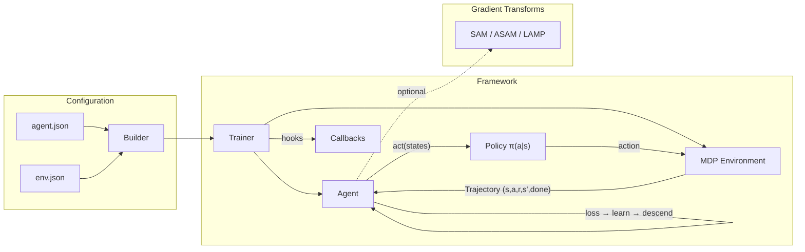

# RLTrain

A modular PyTorch framework for deep reinforcement learning research. JSON-driven configuration, composable neural network architectures, and robust optimisation techniques — designed for comparing RL algorithms across environments with minimal boilerplate.

## Overview

RLTrain separates *what* you train (algorithm + architecture) from *where* you train it (environment) using JSON configuration files with fully-qualified class names. Every component — agent, network, optimiser, environment wrapper — is resolved dynamically at runtime, so new algorithms and architectures slot in without touching the training loop.



## Algorithms

| Algorithm | Class | Method | Key Idea |
|-----------|-------|--------|----------|
| Vanilla Policy Gradient | `VanillaPG` | Policy gradient | REINFORCE without baseline, entropy regularisation |
| REINFORCE | `REINFORCE` | Policy gradient | Learned value baseline reduces variance |
| Vanilla Actor-Critic | `VanillaAC` | Actor-critic | TD error advantage, optional shared feature layers |
| Advantage Actor-Critic | `AdvantageAC` | Actor-critic | GAE (Generalised Advantage Estimation), horizon-based collection |
| PPO | `PPO` | Actor-critic | Clipped surrogate objective, mini-batch epochs, KL early stopping |
| DQN | `VanillaDQN` | Q-learning | Replay buffer, target network with soft updates, epsilon-greedy decay |

All policy gradient and actor-critic agents inherit along a clean chain: `Agent` (ABC) → `VanillaPG` → `REINFORCE` → `VanillaAC` → `AdvantageAC` → `PPO`, with `VanillaDQN` branching from `Agent` directly. Each level adds one concept — baselines, TD bootstrapping, GAE, clipping — making the hierarchy a readable tutorial in itself.

## Neural Network Modules

| Module | Description | Use Case |
|--------|-------------|----------|
| `mlp` | Multi-layer perceptron with orthogonal init | Dense observations (CartPole, Acrobot) |
| `cnn` | Convolutional network with flatten output | Image observations (MinAtar, PLE) |
| `SkipMLP` | D2RL-style MLP with skip connections from input to every hidden layer | Improved gradient flow for deeper networks |
| `RFF` | Random Fourier Features projection layer | Spectral feature encoding for low-dimensional inputs |

## Quick Start

### Installation

```bash
git clone https://github.com/DarkbyteAT/rltrain.git
cd rltrain

# Install with uv (recommended)
uv sync --group dev

# Or with pip
pip install -e ".[dev]"
```


### Training an Agent

**CLI** (thin wrapper around the Trainer API, powered by [typer](https://typer.tiangolo.com/)):

```bash
# Train PPO on CartPole (auto-detects best device: CUDA → MPS → CPU)
python run.py --agent examples/cartpole/ppo.json --env examples/cartpole/env.json --dump results/

# Explicitly select a device backend
python run.py --agent examples/cartpole/ppo.json --env examples/cartpole/env.json --dump results/ --device mps
python run.py --agent examples/cartpole/ppo.json --env examples/cartpole/env.json --dump results/ --device cuda

# Train multiple agents sequentially
python run.py --agent examples/cartpole/ppo.json --agent examples/cartpole/reinforce.json --env examples/cartpole/env.json --dump results/
```

**Trainer API** (programmatic use):

```python
from rltrain.trainer import Trainer
from rltrain.callbacks.checkpoint import CheckpointCallback
from rltrain.callbacks.csv_logger import CSVLoggerCallback
from rltrain.callbacks.plot import PlotCallback
from rltrain.utils.device import resolve_device

device = resolve_device("auto")  # CUDA → MPS → CPU

trainer = Trainer(
    agent,
    env,
    num_steps=100_000,
    checkpoint_steps=2500,
    run_dir=Path("results/ppo/run_1"),
    callbacks=[
        CSVLoggerCallback(),
        PlotCallback(num_steps=100_000),
        CheckpointCallback(save_all=True),
    ],
    seed=42,
)
trainer.fit()
```

### Loading a Trained Agent

After training, load a saved agent for inference or evaluation:

```python
from rltrain.utils.builders import load_agent

# Load the final checkpoint (default)
agent = load_agent("results/PPO/2024-01-15_12-00-00")

# Load a specific step-based checkpoint
agent = load_agent("results/PPO/2024-01-15_12-00-00", checkpoint="2500")

# Explicit device selection
agent = load_agent("results/PPO/2024-01-15_12-00-00", device="cpu")

# Use the agent for inference
import numpy as np
obs = np.array([[1.0, 0.5, -0.2, 0.1]])  # CartPole observation
actions = agent(obs)  # returns numpy array of sampled actions
```

The loaded agent's model is set to evaluation mode. Optimizer state and replay buffers are not restored — use this for inference and evaluation, not continued training.

### CLI Arguments

| Argument | Default | Description |
|----------|---------|-------------|
| `--agent` | required | Path(s) to agent JSON config files (repeat for multiple agents) |
| `--env` | required | Path to environment JSON config file |
| `--dump` | required | Output directory for results |
| `--num-steps` | 100,000 | Total training environment steps |
| `--checkpoint-steps` | 2,500 | Steps between saving metrics and plots |
| `--reward-run-rate` | 0.1 | EMA beta for running average return |
| `--device` | auto | Device backend: `cpu`, `cuda`, `mps`, or `auto` (CUDA → MPS → CPU) |
| `--workers` | 12 | PyTorch inter/intra-op thread count |
| `--seed` | current time | RNG seed for reproducibility |
| `--img` / `--no-img` | false | Channel-first preprocessing for image observations |
| `--save-all` / `--no-save-all` | false | Save model checkpoints at every interval (not just final) |
| `--log-freq` | 1 | Logging frequency (episodes) |
| `--log-level` | INFO | Logging level (DEBUG, INFO, WARNING, ERROR) |

Run `python run.py --help` for auto-generated help.

## Configuration

### Agent Config (`agent.json`)

Agents are specified as JSON objects. The `fqn` field resolves to a Python class at runtime, so any class on the import path works — including your own.

```json
{
    "fqn": "rltrain.agents.actor_critic.PPO",
    "gamma": 0.995,
    "tau": 0.01,
    "beta_critic": 0.5,
    "normalise": true,
    "continuous": false,
    "horizon": 256,
    "lambda_gae": 0.95,
    "num_epochs": 8,
    "batch_size": 128,
    "early_stop": 0.05,
    "eps_clip": 0.2,
    "model": {
        "actor": [{"fqn": "rltrain.nn.SkipMLP", "inputs": 4, "hiddens": [256, 256, 256, 256], "outputs": 2}],
        "critic": [{"fqn": "rltrain.nn.SkipMLP", "inputs": 4, "hiddens": [256, 256, 256, 256], "outputs": 1}]
    },
    "opt": {
        "actor": {"fqn": "torch.optim.Adam", "lr": 3e-4},
        "critic": {"fqn": "torch.optim.Adam", "lr": 3e-4}
    }
}
```

Networks are composed sequentially — each entry in the model list becomes a layer in an `nn.Sequential`. For visual environments, use an embedding CNN followed by an MLP:

```json
{
    "model": {
        "embedding": [{"fqn": "rltrain.nn.cnn", "channels": [4, 16, 32], "kernels": [2, 2], "strides": [2, 1]}],
        "actor": [{"fqn": "rltrain.nn.SkipMLP", "inputs": 512, "hiddens": [256, 256, 256, 256], "outputs": 3}],
        "critic": [{"fqn": "rltrain.nn.SkipMLP", "inputs": 512, "hiddens": [256, 256, 256, 256], "outputs": 1}]
    }
}
```

### Environment Config (`env.json`)

```json
{
    "id": "CartPole-v1",
    "wrappers": [
        {"fqn": "gymnasium.wrappers.NormalizeObservation"}
    ]
}
```

Wrappers are applied in order. Any `gymnasium.Wrapper` subclass works, including custom wrappers.

### Gradient Transforms (SAM / ASAM / LAMP)

Add composable gradient transforms to any agent via the `grad_transforms` key:

```json
{
    "grad_transforms": [
        {"fqn": "samgria.SAM", "rho": 0.01}
    ]
}
```

SAM (Sharpness-Aware Minimization) perturbs weights adversarially before recomputing the gradient, encouraging convergence to flat minima. ASAM adds parameter-magnitude scaling for scale-invariant sharpness. LAMP adds periodic rollback to a moving parameter average. Transforms compose -- stack SAM with LAMP for the full pipeline:

```json
{
    "grad_transforms": [
        {"fqn": "samgria.SAM", "rho": 0.01},
        {"fqn": "samgria.LAMPRollback", "eps": 5e-3, "rollback_len": 10}
    ]
}
```

## Callbacks

The training loop is extensible via the `Callback` protocol. Built-in callbacks handle checkpointing, CSV metrics, and SVG plots. Write a custom callback by implementing any subset of the hook methods:

```python
from pathlib import Path
from rltrain.agents.agent import Agent
from rltrain.callbacks import Callback
from rltrain.env import MDP


class WandbCallback:
    """Example custom callback that logs to Weights & Biases."""

    def on_train_start(self, agent: Agent, env: MDP, run_dir: Path) -> None:
        import wandb
        wandb.init(project="rltrain", name=agent.name)

    def on_episode_end(self, agent: Agent, env: MDP, episode: int) -> None:
        import wandb
        wandb.log({"return": env.return_history[-1], "episode": episode})

    def on_train_end(self, agent: Agent, env: MDP, run_dir: Path) -> None:
        import wandb
        wandb.finish()
```

Pass custom callbacks to the `Trainer`:

```python
trainer = Trainer(
    agent, env,
    num_steps=100_000,
    checkpoint_steps=2500,
    run_dir=run_dir,
    callbacks=[CSVLoggerCallback(), CheckpointCallback(), WandbCallback()],
    seed=42,
)
```

### Video Recording

Record evaluation videos at training checkpoints using gymnasium's `RecordVideo` wrapper:

```python
from rltrain.callbacks.video_recorder import VideoRecorderCallback

# Auto-detect env from training MDP (records 3 episodes per checkpoint):
trainer = Trainer(
    agent, env,
    num_steps=100_000,
    checkpoint_steps=2500,
    run_dir=run_dir,
    callbacks=[
        CSVLoggerCallback(),
        PlotCallback(num_steps=100_000),
        CheckpointCallback(),
        VideoRecorderCallback(),
    ],
)

# Explicit factory with custom wrappers:
VideoRecorderCallback(
    env_fn=lambda: gym.make("CartPole-v1", render_mode="rgb_array"),
    num_episodes=5,
)

# Record every 50th training episode instead of at checkpoints:
VideoRecorderCallback(eval_trigger=lambda ep: ep % 50 == 0)
```

Videos are saved to `run_dir/videos/`. Requires `render_mode="rgb_array"` support — if unavailable, the callback disables itself with a warning. Install the video extra: `pip install rltrain[video]`.

### Hook Methods

| Method | Called | Arguments |
|--------|--------|-----------|
| `on_train_start` | Once, before the loop begins | agent, env, run_dir |
| `on_step` | After every `agent.step()` call | agent, env, step |
| `on_episode_end` | When an episode completes | agent, env, episode |
| `on_checkpoint` | At checkpoint intervals | agent, env, run_dir |
| `on_train_end` | Once, after the loop exits | agent, env, run_dir |

## Experiment Tracking

The `TrackingCallback` adapts the training loop's callback hooks to a pluggable `MetricsLogger` backend. It logs episode returns, lengths, and running returns automatically.

### Quick Start (StreamLogger)

Zero-dependency console output — useful for debugging:

```python
from rltrain.tracking import TrackingCallback
from rltrain.tracking.backends import StreamLogger

tracker = TrackingCallback(StreamLogger(), config=agent_config)

trainer = Trainer(
    agent, env,
    num_steps=100_000,
    checkpoint_steps=2500,
    run_dir=run_dir,
    callbacks=[CSVLoggerCallback(), CheckpointCallback(), tracker],
    seed=42,
)
```

Output:
```
[step 1] return=15.3 length=120 running_return=12.8
[step 2] return=18.7 length=95 running_return=13.4
```

### TensorBoard

```python
from rltrain.tracking.backends import TensorBoardLogger

tracker = TrackingCallback(TensorBoardLogger(), config=agent_config)
```

Requires `pip install tensorboard`. Event files are written to `run_dir/tb/` by default.

### Weights & Biases

```python
from rltrain.tracking.backends import WandbLogger

tracker = TrackingCallback(WandbLogger(project="my-rl-project"), config=agent_config)
```

Requires `pip install wandb`.

### JSONL (FSLogger)

Writes structured JSONL to any fsspec-compatible filesystem (local, S3, GCS):

```python
from rltrain.tracking.backends import FSLogger

tracker = TrackingCallback(FSLogger("s3://bucket/metrics.jsonl"), config=agent_config)
```

Requires `pip install fsspec` (plus the relevant filesystem driver, e.g. `s3fs`).

### JSON Config Integration

All tracking backends work with the FQN builder system:

```json
{
    "callbacks": [
        {"fqn": "rltrain.callbacks.csv_logger.CSVLoggerCallback"},
        {"fqn": "rltrain.callbacks.checkpoint.CheckpointCallback"},
        {
            "fqn": "rltrain.tracking.callback.TrackingCallback",
            "logger": {"fqn": "rltrain.tracking.backends.stream.StreamLogger"},
            "config": {}
        }
    ]
}
```

### Available Backends

| Backend | Class | Dependencies | Use Case |
|---------|-------|-------------|----------|
| Console | `StreamLogger` | None | Debugging, CI logs |
| JSONL | `FSLogger` | `fsspec` | Structured logs, cloud storage |
| TensorBoard | `TensorBoardLogger` | `tensorboard` | Local visualisation |
| W&B | `WandbLogger` | `wandb` | Cloud experiment tracking |
| xptrack | `XptrackLogger` | `xptrack` | Custom experiment tracking (stub) |

## Output

Training produces the following in `<dump>/<agent_name>/<timestamp>/`:

```
config/
    agent.json          # Copy of agent config used
    env.json            # Copy of environment config used
    seed.txt            # RNG seed for reproducibility
models/
    model_FINAL.pt      # Final model state dict
    model_2500.pt       # Intermediate checkpoints (if --save_all)
metrics.csv             # Episode-level metrics (length, return, running return)
per_episode.svg         # Return vs episode plot
per_sample.svg          # Return vs timestep plot
videos/                 # Evaluation videos (if VideoRecorderCallback enabled)
    rl-video-episode-0.mp4
    ...
```

## Experiments

The repository includes pre-configured experiments from the original dissertation research, comparing REINFORCE, A2C, and PPO (each with baseline, SAM, and LAMP variants) across six environments:

| Environment | Type | Observation | Actions |
|-------------|------|-------------|---------|
| CartPole-v1 | Classic control | 4D vector | 2 |
| Acrobot-v1 | Classic control | 6D vector | 3 |
| Catcher-PLE-v0 | PLE game | 4D vector | 3 |
| Pixelcopter-PLE-v0 | PLE game | 7D vector | 2 |
| Breakout-MinAtar-v1 | MinAtar arcade | 10x10x4 image | 3 |
| SpaceInvaders-MinAtar-v1 | MinAtar arcade | 10x10x6 image | 4 |

## Documentation

Full documentation is available at [https://darkbyteat.github.io/rltrain](https://darkbyteat.github.io/rltrain).

To build the docs locally:

```bash
uv sync --group docs
uv run mkdocs serve
```

## Contributing

See [CONTRIBUTING.md](CONTRIBUTING.md) for development setup, code conventions, architecture rules, and key patterns.

## References

See [references/references.bib](references/references.bib) for the papers that inform this framework.

## Origin

RLTrain was built for COMP3200 (Individual Project) at the University of Southampton in 2022, investigating the effect of robust optimisation techniques (SAM and LAMP) on deep reinforcement learning across classic control and visual environments.

## License

MIT
