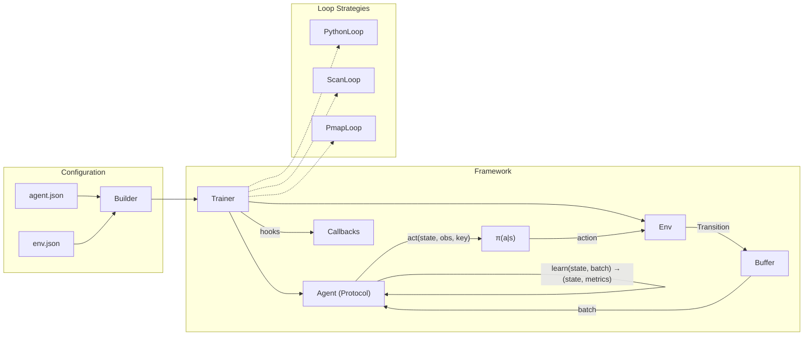

# RLTrain

A modular **JAX** framework for deep reinforcement learning research. JSON-driven configuration, Equinox-native pure-function agents, and three training-loop strategies (Python, `lax.scan`, `pmap`) — designed for comparing RL algorithms across environments with minimal boilerplate.

## Overview

RLTrain separates *what* you train (algorithm + architecture) from *where* you train it (environment) using JSON configuration files with fully-qualified class names. Every component — agent, network, optimiser, environment, callback — is resolved dynamically at runtime, so new algorithms and architectures slot in without touching the training loop.


```mermaid
graph LR
    subgraph Configuration
        AJ["agent.json"] --> B["Builder"]
        EJ["env.json"] --> B
    end

    subgraph Framework
        B --> TR["Trainer"]
        TR --> A["Agent (Protocol)"]
        TR --> E["Env"]
        TR -->|"hooks"| CB["Callbacks"]
        A -->|"act(state, obs, key)"| P["π(a|s)"]
        P -->|"action"| E
        E -->|"Transition"| BUF["Buffer"]
        BUF -->|"batch"| A
        A -->|"learn(state, batch) → (state, metrics)"| A
    end

    subgraph "Loop Strategies"
        TR -.-> PL["PythonLoop"]
        TR -.-> SL["ScanLoop"]
        TR -.-> PM["PmapLoop"]
    end
```

State (parameters, optimiser state, target parameters, ε, log-α) lives in a `chex.dataclass` threaded through `learn`. Agents are `eqx.Module`s with no array leaves — pure architecture, jit-traced once. The whole pipeline composes with `jax.grad`, `jax.vmap`, and `jax.lax.scan`.

## Algorithms

| Algorithm | Class | Family | Key Idea |
|-----------|-------|--------|----------|
| Vanilla Policy Gradient | `VanillaPG` | Policy gradient | REINFORCE without baseline, entropy regularisation |
| REINFORCE | `REINFORCE` | Policy gradient | Learned value baseline reduces variance |
| Vanilla Actor-Critic | `VanillaAC` | Actor-critic | TD error advantage |
| Advantage Actor-Critic | `AdvantageAC` | Actor-critic | Generalised Advantage Estimation, horizon-based collection |
| PPO | `PPO` | Actor-critic | Clipped surrogate, mini-batch epochs, composable epoch terminators |
| SPO | `SPO` | Actor-critic | Quadratic-penalty surrogate $-r_t A_t + |A_t|/(2\varepsilon)(r_t - 1)^2$ |
| Vanilla DQN | `VanillaDQN` | Q-learning | Replay buffer, target network with soft updates, ε-greedy |
| Double DQN | `DoubleDQN` | Q-learning | Online selects, target evaluates |
| Categorical DQN (C51) | `DistributionalDQN` | Q-learning | Distributional Bellman over atom support |
| SAC | `SAC` | Actor-critic | Twin Q + auto-tuned log-α; discrete and continuous action spaces |

All on-policy agents share the `OnPolicyAgent` base (Equinox module + `init/learn/act`). DQN variants share `dqn_learn_step`. SAC is structurally closer to DQN than to the PG chain.

## Quick Start

### Installation

```bash
git clone https://github.com/DarkbyteAT/rltrain.git
cd rltrain
uv sync --group dev
# or: pip install -e ".[dev]"
```

### Training an Agent

**CLI** (thin wrapper around the Trainer API, powered by [typer](https://typer.tiangolo.com/)):

```bash
python -m rltrain.cli \
    --agent examples/cartpole/ppo.json \
    --env examples/cartpole/env.json \
    --dump results/
```

**Trainer API** (programmatic):

```python
import jax
from rltrain.trainer import Trainer
from rltrain.callbacks.csv_logger import CSVLoggerCallback
from rltrain.callbacks.plot import PlotCallback
from rltrain.callbacks.checkpoint import CheckpointCallback

trainer = Trainer(
    agent,
    env,
    num_steps=100_000,
    checkpoint_steps=2_500,
    run_dir="results/ppo/run_1",
    callbacks=[CSVLoggerCallback(), PlotCallback(), CheckpointCallback(save_all=True)],
)
trainer.fit(jax.random.key(42))
```

### Loading a Trained Agent

```python
from rltrain.builders import load_agent

agent, state = load_agent("results/ppo/2026-05-18_12-00-00")
action = agent.act(state, obs, jax.random.key(0))
```

Checkpoints round-trip via `eqx.tree_serialise_leaves` / `eqx.tree_deserialise_leaves`. The default save is `models/model_FINAL.eqx`; per-step checkpoints land at `models/model_{step}.eqx` when `save_all=True`.

## Configuration

### Agent Config (`agent.json`)

The `fqn` field resolves any importable class at runtime; remaining fields become constructor kwargs. Sub-objects with their own `fqn` are recursively built and threaded into the parent.

```json
{
  "fqn": "rltrain.agents.PPO",
  "gamma": 0.99,
  "lambda_gae": 0.95,
  "eps_clip": 0.2,
  "num_epochs": 8,
  "minibatch_size": 128,
  "epoch_terminators": [
    {"fqn": "rltrain.agents.KLEarlyStop", "target_kl": 0.05, "rollback": true}
  ],
  "actor":        {"fqn": "rltrain.networks.MLP", "in_size": 4, "out_size": 64, "width_size": 256, "depth": 3},
  "action_head":  {"fqn": "rltrain.heads.DiscreteHead", "in_features": 64, "num_actions": 2},
  "critic":       {"fqn": "rltrain.networks.MLP", "in_size": 4, "out_size": 1,  "width_size": 256, "depth": 3},
  "optimizer":    {"fqn": "optax.adam", "learning_rate": 3e-4}
}
```

### Environment Config (`env.json`)

```json
{"backend": "gymnax", "id": "CartPole-v1"}
```

The `backend` key dispatches between `GymnaxEnv` (pure-step, jittable, `lax.scan`-able) and `GymnasiumEnv` (Python loop, broad env coverage). When the backend is `gymnax` and the agent is pure-JAX, the trainer auto-selects `ScanLoop` for in-XLA rollouts.

### Epoch Terminators (PPO)

PPO supports composable terminators that halt mini-batch optimisation early within a horizon. `KLEarlyStop` stops when approximate KL exceeds `target_kl`; with `rollback: true` it restores parameters to the pre-epoch state.

## Callbacks

`rltrain.callbacks.Callback` is a `@runtime_checkable` `Protocol` with five hooks: `on_train_start(config, run_dir)`, `on_step(step, metrics)`, `on_episode_end(episode, episode_return, episode_length, running_return)`, `on_checkpoint(step, agent_state, run_dir)`, `on_train_end(agent_state, run_dir)`. All default to no-op. Built-ins:

- `CSVLoggerCallback` — writes `metrics.csv` (`episode, return, length, running_return`)
- `PlotCallback` — renders `per_episode.svg` and `per_sample.svg` at each checkpoint
- `CheckpointCallback` — serialises full `TrainState` pytree (`save_all` for per-step snapshots)
- `VideoRecorderCallback` — gymnasium `RecordVideo` wrapper with optional `eval_trigger` predicate

A `Trainer(callbacks=None)` defaults to the first three.

### Why no `io_callback`

`ScanLoop` accumulates `StepOutput` arrays inside `lax.scan` and fires callbacks Python-side at segment boundaries (one segment per `checkpoint_steps`). This is a deliberate trade-off — no `pure_callback` elision risk, no background-thread queues, no ordering footguns — at the cost of episode-end callback latency. See `rltrain/trainer/_loops.py` for the full rationale.

## Output

A run produces:

```
<dump>/<agent_name>/<timestamp>/
    config/
        agent.json
        env.json
        seed.txt
    models/
        model_FINAL.eqx
        model_{step}.eqx       (with save_all=True)
    metrics.csv
    per_episode.svg
    per_sample.svg
    videos/                    (with VideoRecorderCallback)
```

## Documentation

Full documentation is at [https://darkbyteat.github.io/rltrain](https://darkbyteat.github.io/rltrain). Build locally with `uv run mkdocs serve`.

## Ecosystem

RLTrain is one piece of a sibling-package ecosystem:

| Package | Owns |
|---|---|
| [rltrain](https://github.com/DarkbyteAT/rltrain) | RL algorithms, training loop, callbacks |
| [samgria](https://github.com/DarkbyteAT/samgria) | Gradient transforms (SAM, ASAM, LAMP) — JAX-native |
| [toblox](https://github.com/DarkbyteAT/toblox) | Neural-network building blocks |
| [xptrack](https://github.com/DarkbyteAT/xptrack) | Experiment tracking (DuckDB + dashboards) |

Cross-package integrations (SAM-wrapped optimisers, xptrack logging hooks) compose via standard JAX primitives — `optax.GradientTransformation`, callback Protocols — rather than rltrain-specific abstractions.

## Contributing

See [CONTRIBUTING.md](CONTRIBUTING.md).

## References

See [references/references.bib](references/references.bib).

## Origin

RLTrain was built for COMP3200 (Individual Project) at the University of Southampton in 2022 as a PyTorch framework investigating sharpness-aware optimisation in deep RL. It was ported to JAX in 2026; gradient-transform research moved out to samgria.

## License

MIT
