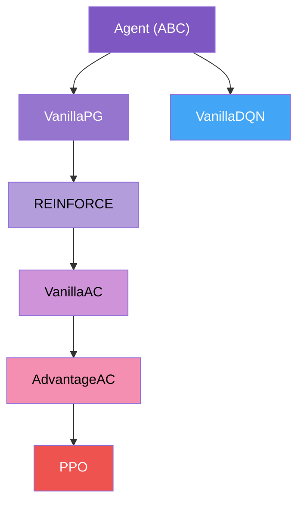

# Algorithms

RLTrain's agent hierarchy is designed as a learning journey. Each subclass adds exactly one new concept to its parent, so reading down the inheritance chain is a tutorial in itself.

## Agent hierarchy

The left branch covers policy gradient and actor-critic methods. The right branch covers value-based methods. Both branches share the abstract `Agent` base class, which defines the template method pattern: `learn()` orchestrates the update, while subclasses override `loss()` and `descend()`.

## Policy gradient branch

### Vanilla Policy Gradient

**Class:** `rltrain.agents.policy_gradient.VanillaPG`
**Adds:** Entropy-regularised policy gradient (REINFORCE without baseline)

The simplest policy gradient agent. Collects a full episode, computes discounted returns $G_t = \sum_{k=0}^{T-t} \gamma^k r_{t+k}$, and updates the policy by ascending the gradient:

$$\nabla_\theta J(\theta) = \mathbb{E}\left[\sum_t G_t \nabla_\theta \log \pi_\theta(a_t | s_t)\right]$$

An entropy bonus $\tau \cdot H(\pi)$ encourages exploration by penalising overly deterministic policies.

**Key hyperparameters:**

| Parameter | Description |
|-----------|-------------|
| `gamma` | Discount factor |
| `tau` | Entropy regularisation coefficient |
| `normalise` | Standardise returns to zero mean, unit variance |

**Reference:** Williams (1992)[^williams1992] -- REINFORCE algorithm.

### REINFORCE

**Class:** `rltrain.agents.policy_gradient.REINFORCE`
**Adds:** Learned value baseline

Subtracting a learned baseline $b(s_t)$ from the return does not change the expected gradient but can dramatically reduce its variance:

$$\nabla_\theta J(\theta) = \mathbb{E}\left[\sum_t (G_t - b(s_t)) \nabla_\theta \log \pi_\theta(a_t | s_t)\right]$$

REINFORCE trains a separate value network (the "critic") as the baseline, minimising $\|V_\phi(s_t) - G_t\|^2$. The critic's loss is weighted by `beta_critic`.

**Key hyperparameters:**

| Parameter | Description |
|-----------|-------------|
| `beta_critic` | Weight of the critic (baseline) loss |

**Reference:** Williams (1992)[^williams1992], Sutton & Barto (2018)[^sutton2018].

## Actor-critic branch

### Vanilla Actor-Critic

**Class:** `rltrain.agents.actor_critic.VanillaAC`
**Adds:** TD error advantage, optional shared feature layers

Instead of waiting for the full episode return, actor-critic methods bootstrap using the value function:

$$A_t = r_t + \gamma V(s_{t+1}) - V(s_t)$$

This one-step TD error serves as the advantage estimate. The actor and critic can optionally share a feature embedding network (specified via the `embedding` key in the model config), which is common in visual RL tasks.

**Key hyperparameters:**

| Parameter | Description |
|-----------|-------------|
| `continuous` | Whether the action space is continuous (Gaussian policy) or discrete (categorical) |

**Reference:** Konda & Tsitsiklis (1999)[^konda1999], Mnih et al. (2016)[^mnih2016].

### Advantage Actor-Critic (A2C)

**Class:** `rltrain.agents.actor_critic.AdvantageAC`
**Adds:** Generalised Advantage Estimation (GAE), horizon-based collection

GAE interpolates between high-bias (one-step TD) and high-variance (Monte Carlo) advantage estimates using an exponentially-weighted average:

$$\hat{A}_t^{\text{GAE}} = \sum_{l=0}^{T-t} (\gamma \lambda)^l \delta_{t+l}$$

where $\delta_t = r_t + \gamma V(s_{t+1}) - V(s_t)$ is the TD error and $\lambda$ controls the bias-variance trade-off. At $\lambda = 0$ this recovers one-step TD; at $\lambda = 1$ it recovers Monte Carlo returns.

Collection switches from episode-based to horizon-based: the agent collects a fixed number of steps (`horizon`) before computing advantages and updating.

**Key hyperparameters:**

| Parameter | Description |
|-----------|-------------|
| `horizon` | Number of steps to collect before each update |
| `lambda_gae` | GAE lambda (bias-variance trade-off) |

**Reference:** Schulman et al. (2016)[^schulman2016gae].

### PPO

**Class:** `rltrain.agents.actor_critic.PPO`
**Adds:** Clipped surrogate objective, mini-batch epochs, KL early stopping

PPO constrains the policy update to a trust region by clipping the probability ratio:

$$L^{\text{CLIP}}(\theta) = \mathbb{E}\left[\min\left(r_t(\theta) \hat{A}_t,\ \text{clip}(r_t(\theta), 1 - \epsilon, 1 + \epsilon) \hat{A}_t\right)\right]$$

where $r_t(\theta) = \frac{\pi_\theta(a_t | s_t)}{\pi_{\theta_{\text{old}}}(a_t | s_t)}$. After collecting a horizon of data, PPO runs multiple epochs of mini-batch gradient descent on the clipped objective. An optional KL divergence early-stopping criterion halts epochs if the policy changes too much.

**Key hyperparameters:**

| Parameter | Description |
|-----------|-------------|
| `eps_clip` | Clipping parameter $\epsilon$ |
| `num_epochs` | Number of optimisation epochs per horizon |
| `batch_size` | Mini-batch size within each epoch |
| `early_stop` | KL divergence threshold for early stopping (0 to disable) |

**Reference:** Schulman et al. (2017)[^schulman2017ppo].

## Value-based branch

### DQN

**Class:** `rltrain.agents.q_learning.VanillaDQN`
**Adds:** Replay buffer, target network with soft updates, epsilon-greedy decay

DQN learns an action-value function $Q(s, a)$ and derives a greedy policy $\pi(s) = \arg\max_a Q(s, a)$. Two key techniques stabilise training:

1. **Experience replay** -- transitions are stored in a buffer and sampled uniformly for training, breaking temporal correlations.
2. **Target network** -- a slowly-updated copy of the Q-network provides stable TD targets. Soft updates use Polyak averaging: $\theta_{\text{target}} \leftarrow (1 - \tau) \theta_{\text{target}} + \tau \theta$.

Exploration uses epsilon-greedy with a linear decay schedule.

**Key hyperparameters:**

| Parameter | Description |
|-----------|-------------|
| `eps_start` | Initial exploration rate |
| `eps_end` | Final exploration rate |
| `eps_decay` | Decay rate for epsilon |
| `batch_size` | Replay buffer sample size |
| `tau` | Soft update coefficient for target network |
| `buffer_size` | Maximum replay buffer capacity |

**Reference:** Mnih et al. (2015)[^mnih2015dqn].

## Gradient transforms

Any agent can optionally use composable gradient transforms for flatter loss landscapes and improved generalisation. Transforms are specified via the `grad_transforms` key in agent JSON config:

- **SAM** (`rltrain.transforms.SAM`) -- adversarial weight perturbation that seeks parameters in flat regions of the loss surface.
- **ASAM** (`rltrain.transforms.ASAM`) -- like SAM but perturbation is scaled by parameter magnitude, making the sharpness measure scale-invariant.
- **LAMP** (`rltrain.transforms.LAMPRollback`) -- injects parameter noise and periodically rolls back to a moving average, encouraging exploration of flatter regions.

Transforms compose naturally -- stack SAM with LAMP by listing both in `grad_transforms`.

## Neural network modules

All agents use composable network modules specified via JSON config. The `SkipMLP` module implements D2RL-style skip connections[^sinha2020d2rl] that concatenate the original input to every hidden layer, improving gradient flow in deeper networks.

**Reference:** Foret et al. (2021)[^foret2021sam].

## References

[^williams1992]: Williams, R. J. (1992). Simple Statistical Gradient-Following Algorithms for Connectionist Reinforcement Learning. *Machine Learning*, 8(3-4), 229-256.
[^sutton2018]: Sutton, R. S. & Barto, A. G. (2018). *Reinforcement Learning: An Introduction* (2nd ed.). MIT Press.
[^konda1999]: Konda, V. R. & Tsitsiklis, J. N. (1999). Actor-Critic Algorithms. *NeurIPS*, 12.
[^mnih2016]: Mnih, V. et al. (2016). Asynchronous Methods for Deep Reinforcement Learning. *ICML*, 48, 1928-1937.
[^schulman2016gae]: Schulman, J. et al. (2016). High-Dimensional Continuous Control Using Generalized Advantage Estimation. *ICLR*.
[^schulman2017ppo]: Schulman, J. et al. (2017). Proximal Policy Optimization Algorithms. *arXiv:1707.06347*.
[^mnih2015dqn]: Mnih, V. et al. (2015). Human-level Control Through Deep Reinforcement Learning. *Nature*, 518(7540), 529-533.
[^foret2021sam]: Foret, P. et al. (2021). Sharpness-Aware Minimization for Efficiently Improving Generalization. *ICLR*.
[^sinha2020d2rl]: Sinha, S. et al. (2020). D2RL: Deep Dense Architectures in Reinforcement Learning. *arXiv:2010.09163*.

The full bibliography is available at [`references/references.bib`](https://github.com/DarkbyteAT/rltrain/blob/main/references/references.bib).
