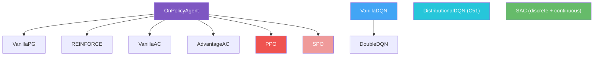

# Algorithms

RLTrain provides ten agents across three families. On-policy agents share an `OnPolicyAgent` base — each subclass overrides only `_loss(...)`. DQN variants share `dqn_learn_step`. SAC and C51 are standalone modules implementing the `Agent` Protocol directly.

## Agent inventory

```mermaid
graph TD
    OPA["OnPolicyAgent"] --> VPG["VanillaPG"]
    OPA --> R["REINFORCE"]
    OPA --> VAC["VanillaAC"]
    OPA --> AAC["AdvantageAC"]
    OPA --> PPO["PPO"]
    OPA --> SPO["SPO"]

    DQN["VanillaDQN"] --> DDQN["DoubleDQN"]
    C51["DistributionalDQN (C51)"]

    SAC["SAC (discrete + continuous)"]

    style OPA fill:#7e57c2,color:#fff
    style PPO fill:#ef5350,color:#fff
    style SPO fill:#ef9a9a,color:#fff
    style DQN fill:#42a5f5,color:#fff
    style C51 fill:#26c6da,color:#fff
    style SAC fill:#66bb6a,color:#fff
```

## Policy-gradient family

### Vanilla Policy Gradient

`rltrain.agents.VanillaPG` — REINFORCE without baseline, with entropy regularisation.

$$\nabla_\theta J(\theta) = \mathbb{E}\left[\sum_t G_t \nabla_\theta \log \pi_\theta(a_t \mid s_t)\right] + \tau \nabla_\theta H(\pi_\theta)$$

| Param | Meaning |
|---|---|
| `gamma` | Discount factor |
| `tau` | Entropy regularisation coefficient |
| `normalise` | Whitens returns via `rltrain.math.center` when True |

Reference: Williams (1992).

### REINFORCE

`rltrain.agents.REINFORCE` — adds a learned value baseline $V_\phi(s)$, fit with MSE weighted by `beta_critic`.

### Vanilla Actor-Critic

`rltrain.agents.VanillaAC` — replaces Monte-Carlo returns with one-step TD advantage $A_t = r_t + \gamma V(s_{t+1}) - V(s_t)$.

### Advantage Actor-Critic (A2C)

`rltrain.agents.AdvantageAC` — Generalised Advantage Estimation (GAE):

$$\hat{A}_t^{\text{GAE}} = \sum_{l=0}^{\infty}(\gamma\lambda)^l \delta_{t+l}, \quad \delta_t = r_t + \gamma V(s_{t+1}) - V(s_t)$$

`lambda_gae` controls the bias-variance trade-off. Collection switches from episode-based to horizon-based.

Reference: Schulman et al. (2016).

### PPO

`rltrain.agents.PPO` — clipped surrogate objective with mini-batch epochs and composable epoch terminators.

$$L^{\text{CLIP}}(\theta) = \mathbb{E}\left[\min\left(r_t(\theta)\hat{A}_t,\ \text{clip}(r_t(\theta), 1-\varepsilon, 1+\varepsilon)\hat{A}_t\right)\right]$$

`KLEarlyStop` (in `rltrain.agents.KLEarlyStop`) is the canonical terminator — it halts epochs when approximate KL exceeds `target_kl`, optionally rolling back parameters.

| Param | Meaning |
|---|---|
| `eps_clip` | Clipping $\varepsilon$ |
| `num_epochs` | Outer epoch count |
| `minibatch_size` | Mini-batch size per epoch |
| `epoch_terminators` | List of `EpochTerminator` instances |

Reference: Schulman et al. (2017).

### SPO

`rltrain.agents.SPO` — quadratic-penalty alternative to PPO's clip:

$$L^{\text{SPO}}(\theta) = -r_t(\theta)\hat{A}_t + \frac{|\hat{A}_t|}{2\varepsilon}(r_t(\theta) - 1)^2$$

Same hyperparameter surface as PPO; smooth penalty replaces the hard clip.

## Value-based family

### Vanilla DQN

`rltrain.agents.VanillaDQN` — Q-learning with experience replay, target network, ε-greedy exploration. Uses `rltrain.math.lerp` for Polyak soft updates: $\theta_{\text{target}} \leftarrow \tau\theta + (1-\tau)\theta_{\text{target}}$.

| Param | Meaning |
|---|---|
| `eps_start`, `eps_end`, `eps_decay` | ε-greedy schedule |
| `target_rate` | Polyak soft-update coefficient |
| `gamma` | Discount factor |

PER (prioritised replay) is a buffer option — `prioritised=True` on the buffer enables IS-weighted updates via `_loss_weighted` (default loop currently uses uniform `_loss`; PER wiring is a tracked tech debt).

Reference: Mnih et al. (2015).

### Double DQN

`rltrain.agents.DoubleDQN` — extends VanillaDQN; only `_loss` differs. Online network selects, target network evaluates.

### Distributional DQN (C51)

`rltrain.agents.DistributionalDQN` — categorical Bellman over a fixed atom support; cross-entropy on the projected PMF. Uses `CategoricalAtomHead` and `rltrain.math.project_distribution` / `q_values_from_pmf`.

Reference: Bellemare et al. (2017).

## Maximum-entropy family

### SAC

`rltrain.agents.SAC` — Soft Actor-Critic with twin Q + auto-tuned log-α. Single class handles both **discrete** (`DiscreteHead`) and **continuous** (`SquashedGaussianHead`) action spaces via an `isinstance` check on the action head. Three optax optimisers (actor, critic, alpha); Polyak on critic targets only.

Reference: Haarnoja et al. (2018), Christodoulou (2019) for the discrete variant.

## Out-of-domain features

- **Gradient transforms (SAM, ASAM, LAMP)** live in [samgria](https://github.com/DarkbyteAT/samgria). They compose as JAX-native primitives — pass a samgria-wrapped optimiser to any agent.
- **Network architectures (SkipMLP, CNN, RFF)** live in [toblox](https://github.com/DarkbyteAT/toblox). Reference them via FQN in the `actor`/`critic` slots of agent JSON.
- **Experiment tracking (W&B, TB, FS, DuckDB)** lives in [xptrack](https://github.com/DarkbyteAT/xptrack). Wire as a callback alongside `CSVLoggerCallback`.
