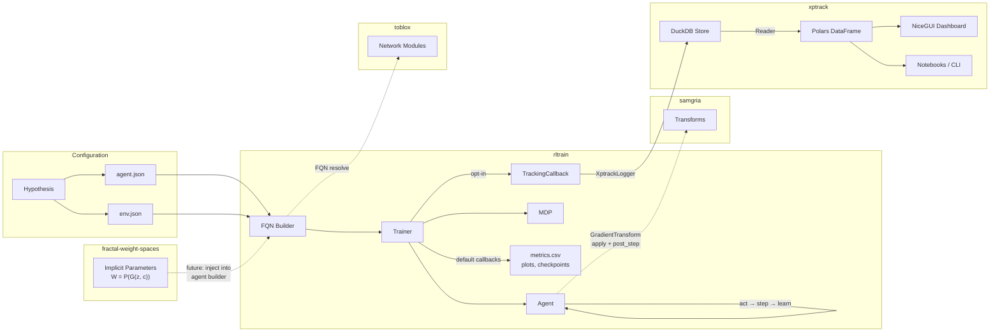

# Research Ecosystem

A modular research ecosystem investigating whether neural network weights exhibit exploitable structure — specifically, whether trained weights can be represented as continuous fields via implicit neural representations, and what this buys for transfer learning, continual learning, and reinforcement learning. The ecosystem spans deep RL, robust optimisation, and neural network weight representations.

Each repository owns one concern and connects to the others via [runtime-checkable protocols](https://docs.python.org/3/library/typing.html#typing.runtime_checkable) (structural subtyping — any class with matching method signatures conforms, no inheritance required) and JSON configuration with fully-qualified class names (FQNs).

## Repositories

| Repository | Purpose | Key Protocols | Dependencies |
|------------|---------|---------------|-------------|
| [rltrain](https://github.com/DarkbyteAT/rltrain) | PyTorch deep RL framework. Separates algorithm, architecture, and environment via JSON config — agents, networks, optimisers, and wrappers are resolved at runtime. | `Agent` (ABC), `Callback`, `MetricsLogger` | torch, gymnasium |
| [samgria](https://github.com/DarkbyteAT/samgria) | Composable gradient transforms for PyTorch. Provides a two-phase protocol for interventions around the gradient descent step — no custom optimiser wrappers needed. | `GradientTransform` (apply + post_step) | torch |
| [toblox](https://github.com/DarkbyteAT/toblox) | Reusable neural network building blocks with orthogonal weight initialisation. Factory functions and modules designed for FQN-driven config composition. | N/A (modules, not protocols) | torch |
| [xptrack](https://github.com/DarkbyteAT/xptrack) | Lightweight experiment tracker with DuckDB storage, pluggable backends, and a NiceGUI dashboard. Zero infrastructure — just a Python library and a database file. | `Store`, `Reader`, `Hook`, `View` | duckdb, polars, nicegui |
| [fractal-weight-spaces](https://github.com/DarkbyteAT/fractal-weight-spaces) | Research on representing neural network weights as continuous fields via implicit neural representations ([SIREN](https://arxiv.org/abs/2006.09661) — periodic activation networks, [Functa](https://arxiv.org/abs/2201.12204) — modulation-based weight sharing). Theory and experiment design for the implicit parameters programme. | N/A (research, not library) | None |
| [python-lib-template](https://github.com/DarkbyteAT/python-lib-template) | Cookiecutter-style template used to scaffold all repos above. Provides pyproject.toml, quality gates (ruff, pyright, pytest, bandit), Makefile, and CI/CD. | N/A (template) | None |

## Data Flow



## Paper-to-Repo Mapping

Papers are numbered by dependency order within the [implicit parameters research programme](https://github.com/DarkbyteAT/fractal-weight-spaces). See the programme's [research overview](https://github.com/DarkbyteAT/fractal-weight-spaces/blob/main/docs/overview.md) for the full theoretical framework.

| Paper | Title | Status | Repos Used |
|-------|-------|--------|------------|
| **1** | Implicit Parameters: Representing Neural Network Weights as Continuous Learned Fields | In progress | fractal-weight-spaces, toblox, xptrack |
| **1.5** | Spectral Sharing and Layer-Role Differentiation | Planned | fractal-weight-spaces, toblox, xptrack |
| **2** | Dual-Head Self-Modulating Implicit Parameters | Planned | fractal-weight-spaces, toblox, samgria, xptrack |
| **3+** | SAM in Modulation Space / Self-Consistent Zero / Functa-FINER Scaling | Planned | fractal-weight-spaces, samgria, xptrack |
| **4+** | Topology / Continual Learning / RL Transfer | Planned | fractal-weight-spaces, rltrain, toblox, samgria, xptrack |
| **Dissertation (2022)** | Effect of Robust Optimisation on Deep RL | Published | rltrain (transforms were inline, later extracted to samgria) |

## Integration Points

The repos connect through three mechanisms: runtime-checkable protocols, the FQN builder system, and shared conventions.

### Protocols

| Protocol | Defined In | Consumed By | Contract |
|----------|-----------|-------------|----------|
| `GradientTransform` | samgria (`samgria.transforms.protocol`) — canonical upstream; rltrain (`rltrain.transforms.protocol`) — vendored copy | `Agent.learn()` pipeline | `apply(model, loss_fn, batch)` pre-descent, `post_step(model)` post-descent |
| `MetricsLogger` | rltrain (`rltrain.tracking.logger`) | `TrackingCallback` | `start(config, run_dir)`, `log_scalars(metrics, step)`, `log_hyperparams(params)`, `finish()` |
| `Callback` | rltrain (`rltrain.callbacks`) | rltrain (`Trainer.fit()`) | 5 hooks: `on_train_start`, `on_step`, `on_episode_end`, `on_checkpoint`, `on_train_end` |
| `Store` / `Reader` | xptrack (`xptrack.store`) | xptrack backends, rltrain via `XptrackLogger` | `write_run()`, `write_metrics()` / `query_runs()`, `query_metrics()` |
| `Hook` | xptrack (`xptrack.hooks`) | xptrack `Run` lifecycle | `on_run_start()`, `on_log()`, `on_run_end()` |
| `View` | xptrack (`xptrack.ui.views`) | xptrack NiceGUI dashboard | `render()`, plus `name`, `icon`, `metric_keys` attributes |

All protocols use `@runtime_checkable` — no inheritance required. Any class with matching method signatures conforms via structural subtyping.

### FQN (Fully-Qualified Name) Builder System

rltrain's JSON configuration resolves fully-qualified Python class names at runtime. Any class that is importable in the current environment works — install the target package (`pip install samgria`, `pip install toblox`) and reference it by its dotted import path. This is how the repos compose without hard imports:

```json
{
    "fqn": "rltrain.agents.actor_critic.PPO",
    "model": {
        "actor": [{"fqn": "toblox.nn.SkipMLP", "inputs": 4, "hiddens": [256, 256], "outputs": 2}],
        "critic": [{"fqn": "toblox.nn.SkipMLP", "inputs": 4, "hiddens": [256, 256], "outputs": 1}]
    },
    "grad_transforms": [
        {"fqn": "samgria.transforms.SAM", "rho": 0.01}
    ]
}
```

Any class on the Python import path works — including classes from samgria, toblox, or user-defined packages. The builder recursively resolves nested FQN references, constructing the full object graph from a single JSON file.

### Shared Conventions

| Convention | Where | Purpose |
|------------|-------|---------|
| Orthogonal weight init | toblox, rltrain `nn/` | Preserves gradient norm through individual layers; combined with skip connections for gradient flow in deep networks |
| `@runtime_checkable` protocols | samgria, rltrain, xptrack | Structural subtyping — no base class coupling |
| FQN through `__init__.py` | All library repos | Shortest public name resolves via re-exports |
| Given-When-Then tests | All repos | Consistent test structure across the ecosystem |
| NumPy-style docstrings | All repos | Consistent documentation format |
| `make all` quality gate | All repos | format-check, lint, typecheck, test in one command |

## Getting Started

### Train an agent

Clone rltrain and run PPO on CartPole:

```bash
# 1. Clone and install
git clone https://github.com/DarkbyteAT/rltrain.git
cd rltrain && uv sync --group dev

# 2. Train PPO on CartPole (auto-detects best device)
python run.py \
    --agent examples/cartpole/ppo.json \
    --env examples/cartpole/env.json \
    --dump results/

# 3. Results appear in results/<agent>/<timestamp>/
ls results/
```

By default, each run produces `metrics.csv` (episode length, return, running return), SVG plots, and model checkpoints in the run directory.

### Multi-seed experiments

A single-seed RL result is not meaningful. Run multiple seeds and compare:

```bash
for seed in 1 2 3 4 5; do
    python run.py \
        --agent examples/cartpole/ppo.json \
        --env examples/cartpole/env.json \
        --dump results/ \
        --seed $seed
done
```

Each seed produces a separate timestamped directory under `results/<agent>/`. To aggregate across seeds, load the `metrics.csv` files with pandas or Polars and compute summary statistics (median, IQR).

### Add experiment tracking with xptrack

For structured storage and querying, wire up `TrackingCallback` with `XptrackLogger`:

```bash
pip install xptrack[ui]
```

```python
from rltrain.tracking import TrackingCallback
from rltrain.tracking.backends import XptrackLogger

tracker = TrackingCallback(
    XptrackLogger(store="experiments.duckdb", project="ppo-cartpole"),
    config=agent_config,
)

# Pass tracker in the callbacks list when constructing Trainer
```

This logs episode metrics and hyperparameters to a DuckDB file. Query results programmatically or launch the dashboard:

```python
import xptrack

# Query runs across seeds
reader = xptrack.query("experiments.duckdb")
runs = reader.query_runs(project="ppo-cartpole")
metrics = reader.query_metrics(run_id="...", keys=["episode/return"])
```

```bash
# Launch the dashboard
xptrack ui --store experiments.duckdb
```

DuckDB uses file-based storage with a single-writer constraint. For parallel training runs, use separate store files per run and merge later, or ensure only one process writes at a time.

See the [experiment tracking guide](../rltrain/tracking/README.md) for all available backends (StreamLogger, TensorBoard, W&B, JSONL).

### Add gradient transforms or custom networks

Install samgria or toblox into the same environment and reference their classes via FQN in the agent JSON config:

```bash
pip install samgria toblox
```

```json
{
    "grad_transforms": [{"fqn": "samgria.transforms.SAM", "rho": 0.01}],
    "model": {
        "actor": [{"fqn": "toblox.nn.SkipMLP", "inputs": 4, "hiddens": [256, 256], "outputs": 2}]
    }
}
```

rltrain bundles its own copy of the gradient transforms (SAM, ASAM, LAMPRollback) under `rltrain.transforms`. samgria is the canonical upstream — use `samgria.transforms.*` FQNs when running samgria as a standalone library or when you need its additional utilities (`ParameterSnapshot` for meta-learning state management). Both implement the same `GradientTransform` protocol.

Note that SAM and ASAM perform a second forward+backward pass per training step to compute gradients at the perturbed point, roughly doubling the per-step wall-clock cost. This is a meaningful trade-off in RL where sample efficiency already matters.
