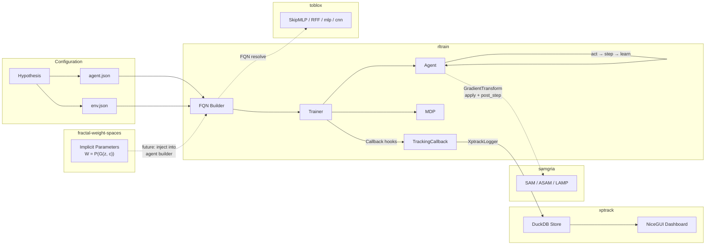

# Research Ecosystem

A modular research ecosystem for deep reinforcement learning, robust optimisation, and neural network weight representations. Each repository owns one concern and connects to the others via runtime-checkable protocols and JSON configuration with fully-qualified class names (FQNs).

## Repositories

| Repository | Purpose | Key Protocols | Dependencies |
|------------|---------|---------------|-------------|
| [rltrain](https://github.com/DarkbyteAT/rltrain) | PyTorch deep RL framework. Separates algorithm, architecture, and environment via JSON config — agents, networks, optimisers, and wrappers are resolved at runtime. | `Agent` (ABC), `Callback`, `MetricsLogger` | torch, gymnasium |
| [samgria](https://github.com/DarkbyteAT/samgria) | Composable gradient transforms for PyTorch. Provides a two-phase protocol for interventions around the gradient descent step — no custom optimiser wrappers needed. | `GradientTransform` (apply + post_step) | torch |
| [toblox](https://github.com/DarkbyteAT/toblox) | Reusable neural network building blocks with orthogonal weight initialisation. Factory functions and modules designed for FQN-driven config composition. | N/A (modules, not protocols) | torch |
| [xptrack](https://github.com/DarkbyteAT/xptrack) | Lightweight experiment tracker with DuckDB storage, pluggable backends, and a NiceGUI dashboard. Zero infrastructure — just a Python library and a database file. | `Store`, `Reader`, `Hook`, `View` | duckdb, polars, nicegui |
| [fractal-weight-spaces](https://github.com/DarkbyteAT/fractal-weight-spaces) | Research on representing neural network weights as continuous fields via implicit neural representations (SIREN, Functa modulation). Theory and experiment design for the implicit parameters programme. | N/A (research, not library) | None |
| [python-lib-template](https://github.com/DarkbyteAT/python-lib-template) | Cookiecutter-style template used to scaffold all repos above. Provides pyproject.toml, quality gates (ruff, pyright, pytest, bandit), Makefile, and CI/CD. | N/A (template) | None |

## Data Flow



## Paper-to-Repo Mapping

Papers are numbered by dependency order within the [implicit parameters research programme](https://github.com/DarkbyteAT/fractal-weight-spaces).

| Paper | Title | Repos Used |
|-------|-------|------------|
| **1** | Implicit Parameters: Representing Neural Network Weights as Continuous Learned Fields | fractal-weight-spaces, toblox, xptrack |
| **1.5** | Spectral Sharing and Layer-Role Differentiation | fractal-weight-spaces, toblox, xptrack |
| **2** | Dual-Head Self-Modulating Implicit Parameters | fractal-weight-spaces, toblox, samgria, xptrack |
| **3+** | SAM in Modulation Space / Self-Consistent Zero / Functa-FINER Scaling | fractal-weight-spaces, samgria, xptrack |
| **4+** | Topology / Continual Learning / RL Transfer | fractal-weight-spaces, rltrain, toblox, samgria, xptrack |
| **Dissertation (2022)** | Effect of Robust Optimisation on Deep RL | rltrain |

## Integration Points

The repos connect through three mechanisms: runtime-checkable protocols, the FQN builder system, and shared conventions.

### Protocols

| Protocol | Defined In | Consumed By | Contract |
|----------|-----------|-------------|----------|
| `GradientTransform` | samgria (`samgria.transforms.protocol`), rltrain (`rltrain.transforms.protocol`) | `Agent.learn()` pipeline | `apply(model, loss_fn, batch)` pre-descent, `post_step(model)` post-descent |
| `MetricsLogger` | rltrain (`rltrain.tracking.logger`) | `TrackingCallback` | `start(config, run_dir)`, `log_scalars(metrics, step)`, `log_hyperparams(params)`, `finish()` |
| `Callback` | rltrain (`rltrain.callbacks`) | rltrain (`Trainer.fit()`) | 5 hooks: `on_train_start`, `on_step`, `on_episode_end`, `on_checkpoint`, `on_train_end` |
| `Store` / `Reader` | xptrack (`xptrack.store`) | xptrack backends, rltrain via `XptrackLogger` | `write_run()`, `write_metrics()` / `query_runs()`, `query_metrics()` |
| `Hook` | xptrack (`xptrack.hooks`) | xptrack `Run` lifecycle | `on_run_start()`, `on_log()`, `on_run_end()` |
| `View` | xptrack (`xptrack.ui.views`) | xptrack NiceGUI dashboard | `render()`, plus `name`, `icon`, `metric_keys` attributes |

All protocols use `@runtime_checkable` — no inheritance required. Any class with matching method signatures conforms via structural subtyping.

### FQN Builder System

rltrain's JSON configuration resolves fully-qualified class names at runtime. This is how the repos compose without hard imports:

```json
{
    "fqn": "rltrain.agents.actor_critic.PPO",
    "model": {
        "actor": [{"fqn": "toblox.nn.SkipMLP", "inputs": 4, "hiddens": [256, 256], "outputs": 2}],
        "critic": [{"fqn": "toblox.nn.SkipMLP", "inputs": 4, "hiddens": [256, 256], "outputs": 1}]
    },
    "grad_transforms": [
        {"fqn": "samgria.transforms.SAM", "rho": 0.01}
    ]
}
```

Any class on the Python import path works — including classes from samgria, toblox, or user-defined packages. The builder recursively resolves nested FQN references, constructing the full object graph from a single JSON file.

### Shared Conventions

| Convention | Where | Purpose |
|------------|-------|---------|
| Orthogonal weight init | toblox, rltrain `nn/` | Preserves gradient norm through layers (Lipschitz = 1) |
| `@runtime_checkable` protocols | samgria, rltrain, xptrack | Structural subtyping — no base class coupling |
| FQN through `__init__.py` | All library repos | Shortest public name resolves via re-exports |
| Given-When-Then tests | All repos | Consistent test structure across the ecosystem |
| NumPy-style docstrings | All repos | Consistent documentation format |
| `make all` quality gate | All repos | format-check, lint, typecheck, test in one command |

## Getting Started

### Train an agent

Clone rltrain and run PPO on CartPole:

```bash
# 1. Clone and install
git clone https://github.com/DarkbyteAT/rltrain.git
cd rltrain && uv sync --group dev

# 2. Train PPO on CartPole (auto-detects best device)
python run.py \
    --agent examples/cartpole/ppo.json \
    --env examples/cartpole/env.json \
    --dump results/

# 3. Results appear in results/<agent>/<timestamp>/
ls results/
```

### Add experiment tracking with xptrack

Install xptrack into the same environment and wire up the `TrackingCallback`:

```bash
# 4. Install xptrack
pip install xptrack[ui]

# 5. Launch the dashboard against the DuckDB store
xptrack ui --store experiments.duckdb
```

To log metrics to xptrack during training, add a `TrackingCallback` with `XptrackLogger` to your training script or JSON config. See [rltrain/tracking/README.md](../rltrain/tracking/README.md) for backend setup.

### Add gradient transforms or custom networks

Install samgria or toblox into the same environment and reference their classes via FQN in the agent JSON config:

```bash
pip install samgria toblox
```

```json
{
    "grad_transforms": [{"fqn": "samgria.transforms.SAM", "rho": 0.01}],
    "model": {
        "actor": [{"fqn": "toblox.nn.SkipMLP", "inputs": 4, "hiddens": [256, 256], "outputs": 2}]
    }
}
```
