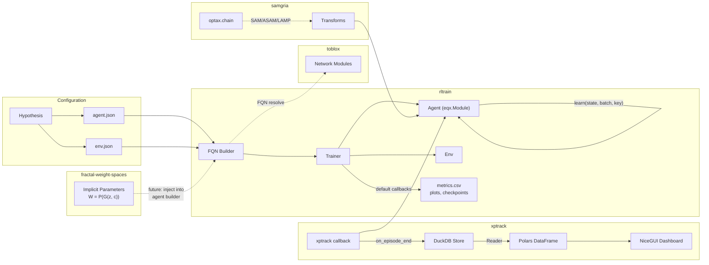

# Research Ecosystem

A modular research ecosystem investigating whether neural network weights exhibit exploitable structure — specifically, whether trained weights can be represented as continuous fields via implicit neural representations, and what this buys for transfer learning, continual learning, and reinforcement learning.

Each repository owns one concern. Repos connect via [runtime-checkable protocols](https://docs.python.org/3/library/typing.html#typing.runtime_checkable) (structural subtyping — any class with matching method signatures conforms, no inheritance required) and JSON configuration with fully-qualified class names (FQNs).

## Repositories

| Repository | Purpose | Key Protocols | Backend |
|------------|---------|---------------|---------|
| [rltrain](https://github.com/DarkbyteAT/rltrain) | JAX deep RL framework. Separates algorithm, architecture, and environment via JSON config — agents, networks, optimisers, and wrappers are resolved at runtime. | `Agent`, `Callback`, `TrainingLoop`, `EpochTerminator` | jax, equinox, optax, gymnax, gymnasium |
| [samgria](https://github.com/DarkbyteAT/samgria) | Composable gradient transforms for JAX. SAM/ASAM/LAMP exposed as `optax.GradientTransformation`-compatible primitives. | `optax.GradientTransformation` | jax, optax |
| [toblox](https://github.com/DarkbyteAT/toblox) | Reusable neural network building blocks with orthogonal weight initialisation. Equinox modules and factory functions designed for FQN-driven config composition. | N/A (modules) | jax, equinox |
| [xptrack](https://github.com/DarkbyteAT/xptrack) | Lightweight experiment tracker with DuckDB storage, pluggable backends, and a NiceGUI dashboard. Zero infrastructure. | `Store`, `Reader`, `Hook`, `View` | duckdb, polars, nicegui |
| [fractal-weight-spaces](https://github.com/DarkbyteAT/fractal-weight-spaces) | Research on representing neural network weights as continuous fields via implicit neural representations (SIREN, Functa). | N/A (research) | jax |
| [loom](https://github.com/DarkbyteAT/loom) | JAX renderer library — connects fractal-weight-spaces hypotheses to training-time evaluation. | N/A (renderer) | jax, equinox |
| [ondes](https://github.com/DarkbyteAT/ondes) | INR primitives — Basis MLPs and Fourier encodings used by loom and fractal-weight-spaces. | N/A (primitives) | jax, equinox |
| [python-lib-template](https://github.com/DarkbyteAT/python-lib-template) | Cookiecutter-style template used to scaffold all repos. Provides pyproject.toml, quality gates, Makefile, CI/CD. | N/A (template) | None |

## Data Flow


```mermaid
graph LR
    subgraph Configuration
        H["Hypothesis"] --> AC["agent.json"]
        H --> EC["env.json"]
    end

    subgraph rltrain
        AC --> B["FQN Builder"]
        EC --> B
        B --> TR["Trainer"]
        TR --> A["Agent (eqx.Module)"]
        TR --> E["Env"]
        A -->|"learn(state, batch, key)"| A
        TR -->|"default callbacks"| CSV["metrics.csv\nplots, checkpoints"]
    end

    subgraph samgria
        OPT["optax.chain"] -.->|"SAM/ASAM/LAMP"| GT["Transforms"]
        GT --> A
    end

    subgraph toblox
        B -.->|"FQN resolve"| NN["Network Modules"]
    end

    subgraph xptrack
        CB["xptrack callback"] --> A
        CB -->|"on_episode_end"| XP["DuckDB Store"]
        XP -->|"Reader"| DF["Polars DataFrame"]
        DF --> D["NiceGUI Dashboard"]
    end

    subgraph fractal-weight-spaces
        FWS["Implicit Parameters\nW = P(G(z, c))"] -.->|"future: inject into\nagent builder"| B
    end
```

## Integration Points

Repos connect through three mechanisms: runtime-checkable protocols, the FQN builder, and shared conventions.

### Protocols

| Protocol | Defined In | Consumed By | Contract |
|----------|-----------|-------------|----------|
| `Agent` | rltrain (`rltrain.agents.agent`) | `Trainer` | `init(key) → state`, `learn(state, batch, key) → (state, metrics)`, `act(state, obs, key) → action` |
| `Callback` | rltrain (`rltrain.callbacks`) | `Trainer.fit()` | 5 hooks fired at segment boundaries |
| `TrainingLoop` | rltrain (`rltrain.trainer._loops`) | `Trainer` | `run(carry, config, callbacks, run_dir)` — `PythonLoop`, `ScanLoop`, `PmapLoop` impls |
| `optax.GradientTransformation` | optax | rltrain agents | `init(params) → state`, `update(grads, state, params) → (updates, state)` — how samgria plugs in |
| `Store` / `Reader` | xptrack | xptrack backends, rltrain via xptrack callback | `write_run()`, `write_metrics()` / `query_runs()`, `query_metrics()` |

All protocols use `@runtime_checkable` — no inheritance required.

### FQN Builder System

rltrain's JSON configuration resolves fully-qualified Python class names at runtime. Any class importable in the current environment works — install the package (`pip install samgria toblox`) and reference it by dotted path:

```json
{
  "fqn": "rltrain.agents.PPO",
  "actor":        {"fqn": "toblox.SkipMLP", "in_size": 4, "width_size": 256, "depth": 4, "out_size": 64},
  "action_head":  {"fqn": "rltrain.heads.DiscreteHead", "in_features": 64, "num_actions": 2},
  "critic":       {"fqn": "rltrain.networks.MLP", "in_size": 4, "out_size": 1, "width_size": 256, "depth": 3},
  "optimizer": {
    "fqn": "optax.chain",
    "transformations": [
      {"fqn": "samgria.sam", "rho": 0.01},
      {"fqn": "optax.adam", "learning_rate": 3e-4}
    ]
  }
}
```

Sub-objects with their own `fqn` are recursively constructed. PRNG sub-keys are auto-spliced into constructors that accept a `key=` parameter.

### Shared Conventions

| Convention | Where | Purpose |
|------------|-------|---------|
| Orthogonal weight init | toblox, rltrain `networks.py` | Preserves gradient norm through layers |
| `@runtime_checkable` protocols | rltrain, xptrack | Structural subtyping — no base class coupling |
| FQN through `__init__.py` | All library repos | Shortest public name resolves via re-exports |
| `chex.dataclass` for state, `eqx.Module` for architecture | rltrain, samgria, loom | Pure-functional JAX idiom |
| Given-When-Then tests | All repos | Consistent test structure |
| `make all` quality gate | All repos | format-check, lint, typecheck, test |

## Getting Started

### Train an agent

```bash
git clone https://github.com/DarkbyteAT/rltrain.git
cd rltrain && uv sync --group dev

python -m rltrain.cli \
    --agent examples/cartpole/ppo.json \
    --env examples/cartpole/env.json \
    --dump results/
```

### Multi-seed experiments

A single-seed RL result is not meaningful. Sweep:

```bash
for seed in 1 2 3 4 5; do
    python -m rltrain.cli \
        --agent examples/cartpole/ppo.json \
        --env examples/cartpole/env.json \
        --dump results/ \
        --seed $seed
done
```

Aggregate across seeds with pandas/polars on `metrics.csv`.

### Add experiment tracking with xptrack

```bash
pip install xptrack[ui]
```

Wire xptrack as a callback in your `Trainer` construction (see the [xptrack docs](https://github.com/DarkbyteAT/xptrack) for the current integration recipe). Query the resulting DuckDB store programmatically or launch `xptrack ui --store experiments.duckdb` for the dashboard.

### Add gradient transforms or custom networks

```bash
pip install samgria toblox
```

Reference them via FQN in the agent JSON — `samgria.sam` plugs into the `optimizer` chain; toblox modules plug into `actor`/`critic`.

Note: SAM and ASAM perform a second forward+backward pass per training step at the perturbed point, roughly doubling per-step wall-clock cost. Meaningful in RL where sample efficiency already matters.
