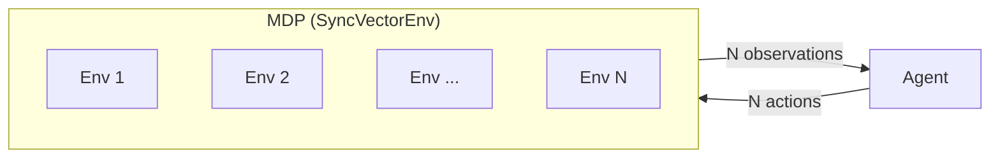

# Multi-Environment Training

Train with multiple copies of the same environment to collect more experience per step, speed up training, and improve gradient estimates through diverse trajectories.

## How It Works

rltrain uses gymnasium's `SyncVectorEnv` to wrap N independent copies of an environment. When you set `num_envs`, the env builder creates N copies and the MDP wrapper manages them as a batch:



Each call to `env.step(agent)`:

1. The agent receives an `(N, obs_dim)` array of observations
2. The agent's forward pass runs once on the full batch, producing N actions
3. All N environments step with their respective actions
4. N transitions are returned as a single `Trajectory` with batched arrays
5. `MDP.total_steps` increments by N

## Configuration

### Via env.json

```json
{
    "id": "CartPole-v1",
    "num_envs": 8,
    "wrappers": []
}
```

### Programmatically

```python
import rltrain.utils.builders as mk
from rltrain.env import MDP

env = MDP(
    mk.env(num_envs=8, id="CartPole-v1", wrappers=[]),
    run_beta=0.05,
    log_freq=10,
    swap_channels=False,
)
```

The `num_envs` parameter defaults to 1, matching the single-env behaviour.

## Effect on Training

### On-policy algorithms (PPO, A2C, REINFORCE)

On-policy algorithms collect a fixed number of transitions before each gradient update. With multiple environments:

- **Horizon fills faster.** PPO with `horizon=256` and `num_envs=8` fills its buffer in 32 `step()` calls instead of 256. This means more frequent parameter updates per wall-clock second.
- **More diverse experience.** Each environment runs an independent episode, so the horizon buffer contains transitions from multiple episode trajectories. This reduces variance in the gradient estimate.
- **Episode boundaries are independent.** Each environment resets independently when its episode ends. The MDP tracks per-env episode statistics (length, return, running return) separately.

### Off-policy algorithms (DQN)

Off-policy algorithms store transitions in a replay buffer and sample mini-batches:

- **Faster buffer fill.** The replay buffer receives N transitions per step, reaching its minimum size sooner.
- **More decorrelated data.** Transitions from N independent environments are naturally less correlated than consecutive transitions from a single environment.

## Episode Statistics

The MDP maintains per-environment counters and records completed episodes independently:

- `env.episode_count` — total completed episodes across all environments
- `env.return_history` — per-episode returns (one entry per completed episode, regardless of which sub-environment it came from)
- `env.run_reward` — exponential moving average of returns, updated on each episode completion

Multiple episodes can complete in a single `step()` call if several environments finish simultaneously.

## Trade-offs

| Benefit | Cost |
|---------|------|
| More transitions per `step()` call | Higher memory usage (N copies of env state) |
| Batched agent forward pass (one GPU call for N observations) | Larger observation/action tensors on device |
| More diverse experience per update | SyncVectorEnv steps envs sequentially (no true parallelism) |
| Faster horizon/buffer fill | May need to tune hyperparameters (learning rate, batch size) for the higher data throughput |

## SyncVectorEnv vs AsyncVectorEnv

rltrain currently uses `SyncVectorEnv`, which steps all N environments sequentially in the main process. The speedup comes from:

- Batching the agent's forward pass (one neural network call instead of N)
- Reduced per-transition Python overhead
- More data per gradient update

For environments with expensive `step()` computations (physics simulations, rendering), `AsyncVectorEnv` would run each environment in a separate subprocess, parallelising the env computation across CPU cores. This is tracked as a future enhancement.

## Example

See [`examples/cartpole_multi_env_demo.py`](../examples/cartpole_multi_env_demo.py) for a complete working example that trains PPO-SAM on CartPole with 8 parallel environments.

```bash
uv run python examples/cartpole_multi_env_demo.py
```
