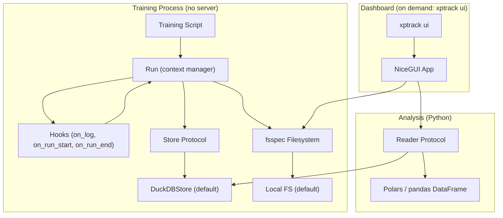
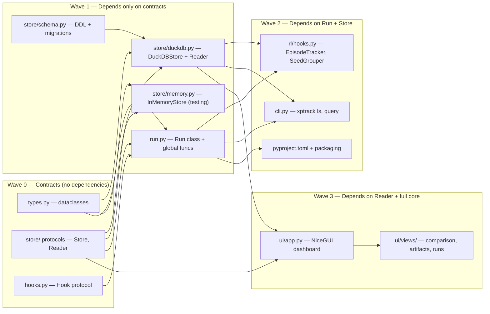

# xptrack — Experiment Tracking for ML Research

**Date:** 2026-03-30
**Status:** Approved
**Package name:** `xptrack` (PyPI: available)
**Repo:** Separate from rltrain, standalone package

## Overview

A lightweight, modular experiment tracker built on battle-tested standards: DuckDB for OLAP storage, fsspec for artifact filesystems, Polars/pandas for analysis, NiceGUI for dashboards. Generic enough for any ML workflow, with RL-aware hooks shipping in core.

Design principles:
- **Zero infrastructure** — no server during training, DuckDB file is the database
- **Protocol-driven** — Store, Reader, Hook are all swappable contracts
- **Standards over invention** — fsspec, DuckDB connection strings, DataFrame protocols
- **YAGNI** — three core deps, everything else is optional extras

## Architecture



## Contracts

### Store Protocol

Writes structured data (runs, metrics, artifact metadata).

```python
from __future__ import annotations

from datetime import datetime
from typing import Any, Protocol, runtime_checkable

from xptrack.types import ArtifactRecord, Metric, RunRecord


@runtime_checkable
class Store(Protocol):
    """Contract for writing structured experiment data."""

    def write_run(self, run: RunRecord) -> None:
        """Persist a new run record."""
        ...

    def write_metrics(self, run_id: str, metrics: list[Metric]) -> None:
        """Persist a batch of metrics for a run."""
        ...

    def write_artifact(self, artifact: ArtifactRecord) -> None:
        """Persist artifact metadata (not the binary data)."""
        ...

    def update_run(self, run_id: str, **fields: Any) -> None:
        """Update mutable fields on a run (status, tags, finished_at, duration_us)."""
        ...
```

### Reader Protocol

Reads structured data, returns DataFrames.

```python
from typing import Protocol

import polars as pl


@runtime_checkable
class Reader(Protocol):
    """Contract for reading experiment data as DataFrames."""

    def query_runs(self, project: str | None = None, **filters: Any) -> pl.DataFrame:
        """Query runs, optionally filtered by project and tag values."""
        ...

    def query_metrics(
        self,
        run_id: str | list[str],
        keys: list[str] | None = None,
    ) -> pl.DataFrame:
        """Query metrics for one or more runs, optionally filtered by key."""
        ...

    def query_artifacts(
        self,
        run_id: str | list[str],
        name: str | None = None,
    ) -> pl.DataFrame:
        """Query artifact metadata for one or more runs."""
        ...
```

### Hook Protocol

Extensions plug in via hooks. Hooks observe events and may emit derived metrics.

```python
from typing import Protocol


class Hook(Protocol):
    """Contract for lifecycle hooks on a Run."""

    def on_run_start(self, run: Run) -> None:
        """Called after run is initialised and store record is written."""
        ...

    def on_log(self, run: Run, metrics: dict[str, float], step: int) -> None:
        """Called after each log() call. May call run.log() to emit derived metrics."""
        ...

    def on_run_end(self, run: Run) -> None:
        """Called before run is finalised in the store."""
        ...
```

### Data Types

```python
import dataclasses as dc
from datetime import datetime
from typing import Any


@dc.dataclass(frozen=True)
class RunRecord:
    run_id: str
    project: str
    name: str
    status: str  # "running", "finished", "failed"
    config: dict[str, Any]
    tags: dict[str, Any]
    started_at: datetime
    finished_at: datetime | None = None
    duration_us: int = 0  # microseconds


@dc.dataclass(frozen=True)
class Metric:
    key: str
    value: float
    step: int
    timestamp: datetime


@dc.dataclass(frozen=True)
class ArtifactRecord:
    run_id: str
    name: str
    step: int
    uri: str  # location in fsspec filesystem
    content: dict[str, Any] | None  # optional structured metadata
    timestamp: datetime
```

## Schema

Four tables in the default DuckDB store:

### `runs`

| Column | Type | Description |
|--------|------|-------------|
| `run_id` | `VARCHAR` PK | UUID |
| `project` | `VARCHAR` | Grouping key |
| `name` | `VARCHAR` | Human-readable name |
| `status` | `VARCHAR` | running / finished / failed |
| `config` | `JSON` | Hyperparameters |
| `tags` | `JSON` | Arbitrary key-value metadata |
| `started_at` | `TIMESTAMP` | Run start (microsecond precision) |
| `finished_at` | `TIMESTAMP` | Run end (null while running) |
| `duration_us` | `BIGINT` | Wall-clock duration in microseconds |

### `metrics`

| Column | Type | Description |
|--------|------|-------------|
| `run_id` | `VARCHAR` FK | Links to runs |
| `key` | `VARCHAR` | Metric name |
| `value` | `DOUBLE` | Scalar value |
| `step` | `BIGINT` | User-provided step counter |
| `timestamp` | `TIMESTAMP` | Wall-clock time of log call |

### `artifacts`

| Column | Type | Description |
|--------|------|-------------|
| `run_id` | `VARCHAR` FK | Links to runs |
| `name` | `VARCHAR` | Artifact name |
| `step` | `BIGINT` | Step when saved |
| `uri` | `VARCHAR` | fsspec-compatible URI |
| `content` | `JSON` | Optional structured metadata |
| `timestamp` | `TIMESTAMP` | When logged |

### `metadata`

| Column | Type | Description |
|--------|------|-------------|
| `key` | `VARCHAR` PK | e.g., "schema_version" |
| `value` | `VARCHAR` | The value |

## Public API

### Core (always available)

```python
import xptrack

# Instance-based (recommended)
with xptrack.Run(
    project="ppo-cartpole",
    name="seed-42",
    store="experiments.duckdb",       # str → DuckDB connection string
    fs=fsspec.filesystem("file"),     # default: local filesystem
    config={"lr": 3e-4, "gamma": 0.99},
    tags={"seed": 42, "env": "CartPole-v1"},
    hooks=[SomeHook()],
) as run:
    run.log({"train/loss": 0.5, "train/return": 200.0}, step=1000)
    run.tag({"phase": "exploitation"})
    run.artifact("checkpoint", data=model_bytes, step=1000, content={
        "architecture": model.config_dict(),
    })

# Global convenience (delegates to internal default run)
xptrack.init(project="ppo-cartpole", name="seed-42", store="experiments.duckdb")
xptrack.log({"train/loss": 0.5}, step=1000)
xptrack.finish()

# Query
df = xptrack.query("experiments.duckdb").query_runs(project="ppo-cartpole")
```

### RL Hooks (ships with core)

```python
from xptrack.rl import EpisodeTracker, SeedGrouper

with xptrack.Run(
    project="ppo",
    hooks=[EpisodeTracker(reward_key="reward", done_key="done")],
) as run:
    for step in range(100_000):
        run.log({"reward": r, "done": done}, step=step)
        # EpisodeTracker automatically derives:
        #   episode/return, episode/length, episode/count
```

### CLI

```bash
xptrack ui --store experiments.duckdb          # NiceGUI dashboard
xptrack ls --store experiments.duckdb          # list projects/runs
xptrack query --project ppo --format csv       # export
```

## Package Structure

```
xptrack/
├── __init__.py          # Public API surface
├── run.py               # Run class, context manager, global functions
├── types.py             # RunRecord, Metric, ArtifactRecord dataclasses
├── hooks.py             # Hook protocol
├── store/
│   ├── __init__.py      # Store and Reader protocols
│   ├── duckdb.py        # DuckDBStore + DuckDBReader
│   └── schema.py        # DDL, migrations, metadata
├── rl/
│   ├── __init__.py      # EpisodeTracker, SeedGrouper exports
│   └── hooks.py         # RL hook implementations
├── ui/                  # Only with xptrack[ui]
│   ├── __init__.py
│   ├── app.py           # NiceGUI application
│   └── views/           # Dashboard pages
└── cli.py               # CLI entry points
```

## Dependencies

| Install | Deps |
|---------|------|
| `xptrack` | `duckdb`, `fsspec`, `polars` |
| `xptrack[ui]` | + `nicegui`, `plotly` |
| `xptrack[remote]` | + `s3fs`, `gcsfs` |
| `xptrack[dev]` | + `pytest`, `ruff`, `pyright`, `behave` or `pytest-bdd` |

## Testing Strategy

Behaviour-driven Given-When-Then scenarios as the primary testing approach.

### Scenario Categories

**Core Run lifecycle:**
```gherkin
Scenario: Complete run lifecycle
  Given a DuckDB store at ":memory:"
  When I create a Run with project "test" and name "run-1"
  And I log {"loss": 0.5} at step 1
  And I log {"loss": 0.3} at step 2
  And I finish the run
  Then the store contains 1 run with status "finished"
  And the store contains 2 metrics for run "run-1"
  And the run duration_us is greater than 0

Scenario: Run as context manager auto-finishes
  Given a DuckDB store at ":memory:"
  When I use a Run context manager and log {"loss": 0.5} at step 1
  Then the store contains 1 run with status "finished"

Scenario: Run records failure on exception
  Given a DuckDB store at ":memory:"
  When a Run context manager raises an exception during training
  Then the store contains 1 run with status "failed"
```

**Global convenience API:**
```gherkin
Scenario: Global functions delegate to default run
  Given a DuckDB store at ":memory:"
  When I call xptrack.init with project "test"
  And I call xptrack.log with {"loss": 0.5} at step 1
  And I call xptrack.finish
  Then the store contains 1 run with status "finished"
```

**Store protocol conformance:**
```gherkin
Scenario Outline: Store implementation writes and reads runs
  Given a <store_type> store
  When I write a RunRecord with project "test"
  Then querying runs for project "test" returns 1 result

  Examples:
    | store_type |
    | DuckDB     |
    | InMemory   |
```

**Hook lifecycle:**
```gherkin
Scenario: Hooks fire in order
  Given a DuckDB store at ":memory:"
  And a hook that records event names
  When I create a Run with that hook and log one metric and finish
  Then the hook received events [on_run_start, on_log, on_run_end]

Scenario: Hook emits derived metrics
  Given a DuckDB store at ":memory:"
  And an EpisodeTracker hook
  When I log reward=1.0 done=false at step 1
  And I log reward=2.0 done=true at step 2
  Then the store contains a metric "episode/return" with value 3.0
  And the store contains a metric "episode/length" with value 2
```

**Artifact storage:**
```gherkin
Scenario: Artifact metadata and binary stored separately
  Given a DuckDB store at ":memory:" and a local fsspec filesystem
  When I log an artifact "checkpoint" with 100 bytes of data at step 500
  Then the store contains 1 artifact record with name "checkpoint"
  And the filesystem contains a file at the artifact URI
  And reading the file returns 100 bytes
```

**RL extension scenarios:**
```gherkin
Scenario: EpisodeTracker computes returns across episode boundary
  Given a DuckDB store and an EpisodeTracker hook
  When I log a sequence of rewards [1, 2, 3] with done=[false, false, true]
  Then "episode/return" equals 6.0
  And "episode/length" equals 3
  And "episode/count" equals 1

Scenario: Multiple episodes tracked correctly
  Given a DuckDB store and an EpisodeTracker hook
  When I log two complete episodes with returns 10.0 and 20.0
  Then "episode/count" equals 2
  And querying "episode/return" returns values [10.0, 20.0]
```

**Dashboard rendering (scenario-based UI tests):**
```gherkin
Scenario: Dashboard renders run comparison table
  Given a store with 3 runs in project "ppo" with different configs
  When I launch the dashboard and navigate to project "ppo"
  Then I see a table with 3 rows
  And each row shows run name, status, and config values

Scenario: Dashboard renders metric comparison chart
  Given a store with 2 runs each having 100 "train/loss" metrics
  When I select both runs and view the "train/loss" chart
  Then I see 2 overlaid line plots with 100 points each
```

## Dependency Graph (Critical Path)



### Wave Execution Plan

| Wave | Cards (all parallelisable within wave) | Depends on |
|------|---------------------------------------|------------|
| **0** | types.py, Store/Reader protocols, Hook protocol | Nothing |
| **1** | DuckDBStore, InMemoryStore, schema.py, Run class + global API | Wave 0 |
| **2** | RL hooks, CLI, pyproject.toml + packaging, BDD test suite | Wave 1 |
| **3** | NiceGUI dashboard app, dashboard views, Trello/README/docs | Wave 2 |
