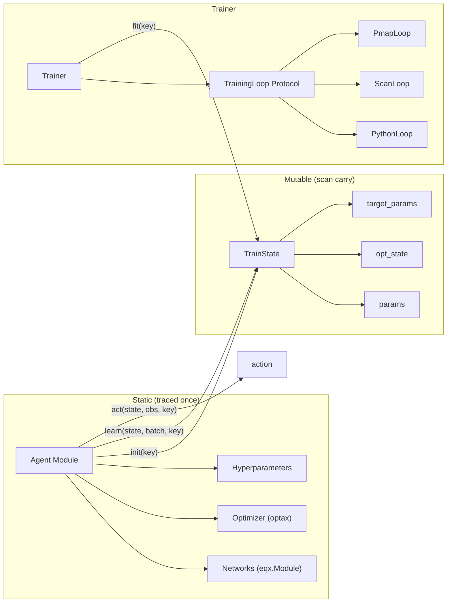
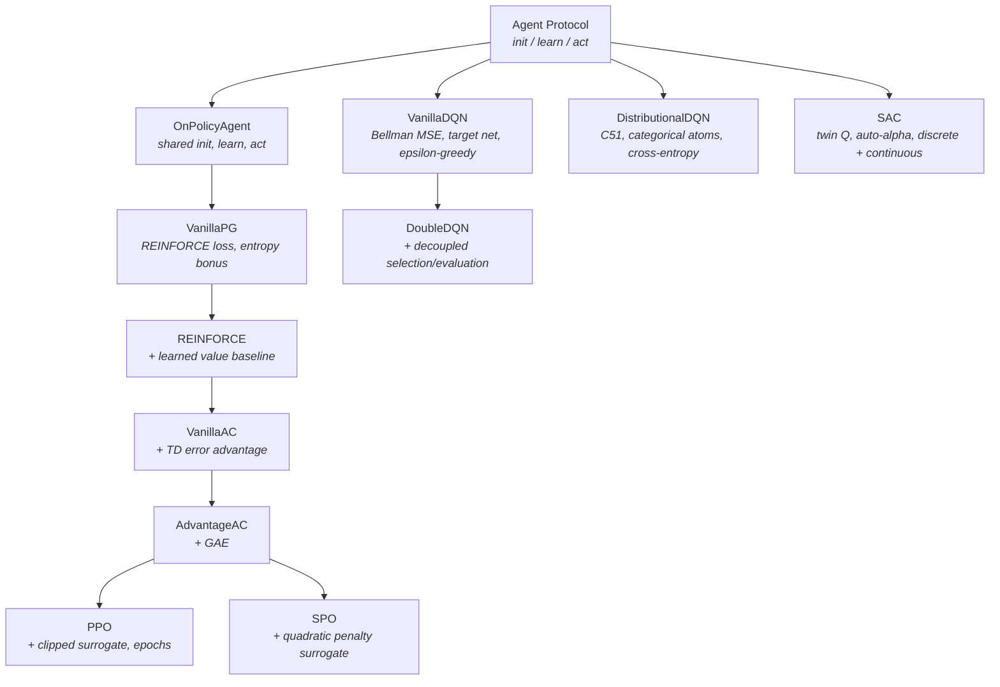

# JAX RL Spike

Self-contained proof-of-concept for porting rltrain from PyTorch to JAX. The spike implements the full agent hierarchy, a unified experience buffer, three training loop strategies, and a callback system -- all as pure functions composable with `jax.grad`, `jax.vmap`, and `jax.lax.scan`.

The goal is to prove that JAX produces cleaner, faster, and more composable RL code than PyTorch, while preserving rltrain's design philosophy of one-concept-per-level agent inheritance and JSON-free programmatic configuration.

## Dependency Stack

| Package | Role |
|---------|------|
| `jax` | Autodiff, JIT compilation, `vmap`, `lax.scan`, `pmap` |
| `equinox` | Neural network modules as pytrees (`eqx.Module`) |
| `optax` | Optimizers and learning rate schedules |
| `chex` | Dataclass pytrees (`@chex.dataclass`), shape assertions |
| `jaxtyping` | Array type annotations (`Float[Array, "B D"]`) |
| `distreqx` | Probability distributions (`Categorical`, `Normal`, `Beta`, `Gamma`) |
| `gymnax` | Jittable gymnasium environments for `lax.scan` rollouts |
| `gymnasium` | Standard RL environments (Python-loop fallback) |
| `moviepy` | Video recording for evaluation rollouts (optional) |

## Architecture

The spike separates static structure from mutable state. An agent module (`eqx.Module`) holds network architecture, hyperparameters, and the optimizer -- no array leaves. All trainable state lives in a `TrainState` pytree that flows through the training loop as a pure value.

This separation gives three properties for free:

1. **JIT** traces the agent once and compiles it as a constant.
2. **`jax.grad`** composes through `learn()` because the state is a pure pytree -- second-order gradients (MAML) work without `create_graph=True`.
3. **The Trainer is generic** over the state type `S` and never inspects its fields.



### Training Loop Strategies

The Trainer delegates to a `TrainingLoop` strategy selected from `env.capabilities`:

| Strategy | When | How |
|----------|------|-----|
| `PythonLoop` | `GymnasiumEnv` (opaque Python env) | Python for-loop with JIT'd `act`/`learn`. Fires callbacks inline. |
| `ScanLoop` | `GymnaxEnv` (jittable env) | `lax.scan` over checkpoint-sized segments. Shape discovery via `jax.eval_shape`. Callbacks at segment boundaries. |
| `PmapLoop` | Multi-device | `jax.pmap` over `ScanLoop`. Each device trains independently; metrics averaged at checkpoints. |

The user can override the auto-selection via `Trainer(..., loop=PythonLoop())`.

### On-Policy vs Off-Policy Dispatch

The on-policy/off-policy distinction is derived from `collect_size` at trace time:

- **On-policy** (`collect_size > 1`): buffer is drained after each learn step (`buffer_drain`). Used by VanillaPG, REINFORCE, VanillaAC, AdvantageAC, PPO, SPO.
- **Off-policy** (`collect_size == 1`): buffer is sampled uniformly or with priorities (`buffer_sample`). Used by VanillaDQN, DoubleDQN, DistributionalDQN, SAC.

This is a Python-level branch resolved before tracing, so JAX sees only one code path.

## Agent Hierarchy



Each level adds exactly one concept. On-policy agents inherit `init`, `learn`, and `act` from `OnPolicyAgent` and override only `_loss`. PPO and SPO override `learn` for their multi-epoch mini-batch loops. DQN variants share `dqn_learn_step` for Polyak averaging and epsilon decay. SAC manages three separate optimizers (actor, critic, alpha) with structural stop-gradient.

## How to Add a New Agent

1. **Create a file** in `spike/agents/` (e.g. `spike/agents/td3.py`).
2. **Define a state type** if the canonical `TrainState` is insufficient. Use `@chex.dataclass` so it works as a `lax.scan` carry. The Trainer is generic over `S`.
3. **Implement the three protocol methods**:
   - `init(key) -> S`: construct params, opt_state, target_params.
   - `learn(state, batch, key) -> (state, metrics)`: one optimisation step. Return a `dict[str, Float[Array, ""]]` of scalar metrics.
   - `act(state, obs, key) -> action`: action selection for environment interaction.
4. **Set `collect_size`** as a class variable if on-policy (e.g. `collect_size: ClassVar[int] = 256`). Off-policy agents default to 1.
5. **Re-export** from `spike/agents/__init__.py`.
6. **Write an example** in `spike/examples/` that trains the agent on a simple env.
7. **Write tests** verifying the loss computation, gradient flow, and state updates.

For on-policy agents, subclass `OnPolicyAgent` and override `_loss`. For off-policy agents with target networks, use `dqn_learn_step` or write a custom `learn`.

## How to Run

```bash
# Activate the spike's virtual environment (NOT the main rltrain venv)
source .venv-spike/bin/activate

# Run tests (--noconftest avoids loading the PyTorch test fixtures)
PYTHONPATH=. pytest tests/spike/ -v --noconftest

# Run an example
PYTHONPATH=. python spike/examples/cartpole_ppo.py

# Run all examples
for f in spike/examples/*.py; do
    echo "--- $f ---"
    PYTHONPATH=. python "$f"
done
```

## Examples

| Example | Proves | Env | Strategy |
|---------|--------|-----|----------|
| `cartpole_ppo.py` | PPO parity with PyTorch rltrain | GymnasiumEnv (CartPole) | PythonLoop |
| `cartpole_multi_env.py` | Scan-strategy auto-dispatch for gymnax envs | GymnaxEnv (CartPole) | ScanLoop |
| `cartpole_dqn.py` | Off-policy pipeline (VanillaDQN, DoubleDQN, C51) | GymnaxEnv (CartPole) | ScanLoop |
| `cartpole_sac.py` | SAC on discrete action spaces | GymnasiumEnv (CartPole) | PythonLoop |
| `cartpole_full_demo.py` | Full pipeline with CSV + video callbacks | GymnaxEnv (CartPole) | ScanLoop |
| `pendulum_ppo.py` | Head swap for continuous control (PPO + SPO) | GymnasiumEnv (Pendulum) | PythonLoop |
| `pendulum_sac.py` | Continuous control with squashed Gaussian | GymnasiumEnv (Pendulum) | PythonLoop |
| `showcase_jit_trace.py` | JAXPR inspection, compile vs execute timing | Synthetic | N/A |
| `showcase_maml_ppo.py` | Second-order gradients through `learn()` | Synthetic | N/A |
| `showcase_scan_benchmark.py` | `lax.scan` speedup over Python loops | GymnaxEnv (CartPole) | Both |
| `showcase_vmap_seed_sweep.py` | `vmap` over full training runs (N seeds, 1 XLA call) | GymnaxEnv (CartPole) | Scan (manual) |

The `showcase_*` examples demonstrate JAX superpowers that have no PyTorch equivalent: native second-order gradients, fused scan loops, and vmapped seed sweeps.

## Callback Protocol

Five hooks, structural subtyping (no base class required):

| Hook | When | Signature |
|------|------|-----------|
| `on_train_start` | Once before the loop | `(config: dict, run_dir: Path \| None)` |
| `on_step` | After each `learn()` call | `(step: int, metrics: dict[str, float])` |
| `on_episode_end` | When an episode completes | `(episode: int, episode_return: float, episode_length: int)` |
| `on_checkpoint` | At checkpoint intervals | `(step: int, agent_state, run_dir: Path \| None)` |
| `on_train_end` | Once after the loop exits | `(agent_state, run_dir: Path \| None)` |

All hooks receive Python values, not JAX arrays. Callbacks must not modify agent or environment state.

Built-in callbacks: `CSVLoggerCallback` (episode metrics to CSV), `VideoRecorderCallback` (MP4 eval rollouts via gymnasium).

### ScanLoop Metric Limitation

`lax.scan` requires fixed pytree structure for its outputs. The ScanLoop discovers metric keys at trace time via `jax.eval_shape` and emits only scalar metrics. Non-scalar metrics are dropped with a warning. This means agents that return non-scalar auxiliary data (e.g. per-sample TD errors) will have those fields available only in PythonLoop. Design agent `learn()` return values with scalar metrics for scan compatibility.

## Key Design Differences from PyTorch rltrain

| Aspect | PyTorch rltrain | JAX spike |
|--------|----------------|-----------|
| Agent state | Mutable `self.model`, `self.optimizer` | External `TrainState` pytree |
| Gradient flow | `loss.backward()` + `optimizer.step()` | `eqx.filter_value_and_grad` + `optax.apply_updates` |
| Second-order grads | `create_graph=True`, manual management | `jax.grad(jax.grad(...))` -- native |
| Training loop | Python for-loop only | Three strategies: Python, scan, pmap |
| Multi-env | `SyncVectorEnv` (process-level) | `vmap` (compiler-level) |
| Seed sweeps | Sequential or multiprocessing | `vmap` over full training runs |
| Configuration | JSON + FQN builder | Programmatic (no JSON) |
| Callbacks | 5 hooks via env/agent objects | 5 hooks via Python scalars |
