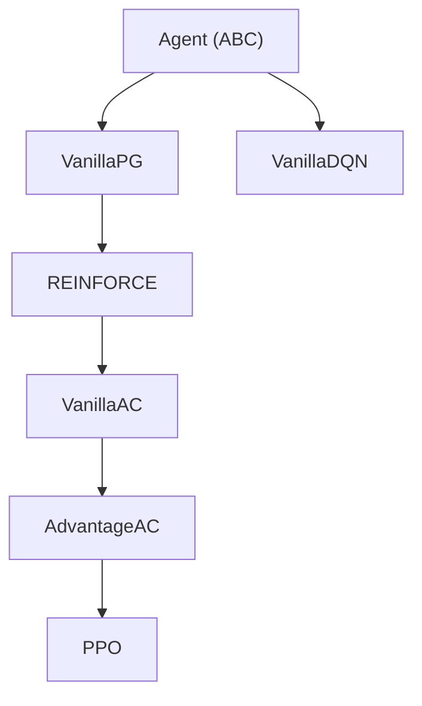

# Agents

Reinforcement learning agents built on a deliberate inheritance chain where each level adds exactly one concept.

## Inheritance Chain

The policy gradient chain (`VanillaPG` through `PPO`) lives in two subpackages: `policy_gradient/` for the baseline-free and baseline variants, and `actor_critic/` for TD-bootstrapped methods. `VanillaDQN` branches directly from `Agent` in `q_learning/`.

## Template Method Pattern

`Agent` is an abstract base class. The key orchestration method is `learn()`, which is **not** overridden by subclasses. It defines the fixed optimisation pipeline:

1. `loss(*batch)` -- compute the loss (backpropagated by `learn()`).
2. `GradientTransform.apply()` -- pre-descent hooks (e.g. SAM perturbation).
3. `descend()` -- optimizer step with optional gradient clipping.
4. `GradientTransform.post_step()` -- post-descent hooks (e.g. LAMP rollback).

Subclasses implement these abstract methods:

| Method | Purpose |
|--------|---------|
| `setup()` | Move networks to device, create optimizers |
| `act(states)` | Return a `torch.distributions.Distribution` representing the policy |
| `step(env)` | Collect experience from the MDP, decide when to call `learn()` |
| `load()` | Convert memory into a tuple of batched tensors |
| `loss(*batch)` | Compute the scalar loss |
| `descend()` | Optimizer step, gradient clipping, and any per-step bookkeeping (e.g. epsilon decay, target network update) |

## What Each Level Adds

| Class | Module | Adds |
|-------|--------|------|
| `VanillaPG` | `policy_gradient/vanilla.py` | Softmax/Gaussian policy, episode-based rollouts, entropy regularisation |
| `REINFORCE` | `policy_gradient/baseline.py` | Learned value baseline (critic) to reduce variance |
| `VanillaAC` | `actor_critic/vanilla.py` | TD error advantage, optional shared embedding features |
| `AdvantageAC` | `actor_critic/a2c.py` | Generalised Advantage Estimation (GAE), horizon-based collection instead of episode-based |
| `PPO` | `actor_critic/ppo.py` | Clipped surrogate objective, mini-batch epochs, KL early stopping with parameter backtracking |
| `VanillaDQN` | `q_learning/vanilla.py` | Replay buffer, target network with soft updates, epsilon-greedy decay |

## How to Add a New Agent

1. Identify where it fits in the chain. If it extends an existing concept, subclass the appropriate agent. If it introduces a fundamentally different paradigm, subclass `Agent` directly.
2. Create a new file in the appropriate subpackage (`policy_gradient/`, `actor_critic/`, or `q_learning/`). If none fit, create a new subpackage.
3. Implement the abstract methods. Override only what changes -- the chain is designed for incremental overrides.
4. Re-export the class from the subpackage's `__init__.py` and from `rltrain/agents/__init__.py`.
5. Verify it works with the FQN builder: the agent must be constructable via `rltrain.utils.builders.agent()` with JSON config kwargs.
6. All networks must use orthogonal weight initialisation.

## Conventions

- Set `name: str` as a class attribute for display and logging.
- Use PyTorch aliases: `T` for `torch`, `nn` for `torch.nn`, `dst` for `torch.distributions`, `F` for `torch.nn.functional`.
- New optimisation techniques (gradient manipulation, parameter perturbation) belong in [samgria](https://github.com/DarkbyteAT/samgria), not in `learn()` or subclass overrides.
- Policy gradient agents support both discrete (`Categorical`) and continuous (`MultivariateNormal`) action spaces via the `continuous` flag.
