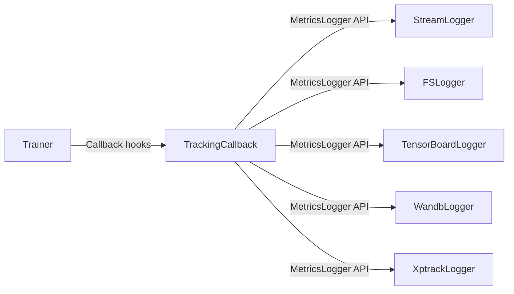

# Experiment Tracking

Pluggable experiment tracking via a two-layer adapter pattern: `TrackingCallback` bridges the training loop's `Callback` hooks to a `MetricsLogger` backend.

## Architecture

## MetricsLogger Protocol

`MetricsLogger` is a `@runtime_checkable` Protocol defined in `logger.py`. `TrackingCallback` calls all four methods unconditionally, so backends must define all of them. Use `...` as the body for methods that don't apply — no inheritance required.

| Method | When | Purpose |
|--------|------|---------|
| `start(config, run_dir)` | Training begins | Initialise the backend, open connections/files |
| `log_scalars(metrics, step)` | Each episode end | Record a batch of scalar metrics at a given step |
| `log_hyperparams(params)` | Training begins | Record experiment hyperparameters |
| `finish()` | Training ends | Flush and close resources |

## TrackingCallback

Defined in `callback.py`. Wraps a `MetricsLogger` and an experiment config dict. It automatically logs episode return, length, and running return on each `on_episode_end` hook. The config is passed at construction time because the `Callback` protocol's `on_train_start` signature does not include the raw configuration dictionary.

## Available Backends

All backends live in the `backends/` subpackage and are re-exported from `rltrain.tracking.backends`.

| Backend | Class | Dependencies | Description |
|---------|-------|-------------|-------------|
| Console | `StreamLogger` | None | Human-readable metric lines to any text stream (stdout by default) |
| JSONL | `FSLogger` | `fsspec` | Structured JSONL to any fsspec-compatible filesystem (local, S3, GCS) |
| TensorBoard | `TensorBoardLogger` | `tensorboard` | TensorBoard event files written to `run_dir/tb/` |
| W&B | `WandbLogger` | `wandb` | Weights & Biases cloud experiment tracking |
| xptrack | `XptrackLogger` | `xptrack` | Custom experiment tracker integration (stub) |

## How to Add a New Backend

1. Create a new file in `rltrain/tracking/backends/`.
2. Implement a class with methods matching the `MetricsLogger` protocol (no inheritance required).
3. Re-export from `rltrain/tracking/backends/__init__.py`.
4. The backend is now usable via FQN in JSON configs or by importing it directly.

Backends with optional dependencies should import those dependencies lazily (inside method bodies) so that the module can be imported without the dependency installed.
